## Objective
#### We have been asked to forecast power consumption by submeter for a client's residential home. The objective is to visualize and forecast energy use by performing time series linear regression and Holt Winters modeling on each submeter. Forecasted results will help client determine energy use patterns and energy saving recommendations will be offered based on results.

## Data Description
#### Data consists of energy consumed per minute for 3 different sub-meters in residential home in Seaux, France between December 2006 and November 2010 (47 months). It contains over 2 million minute observations of electric power consumption. 

<table class="table table-striped table-hover" style="width: auto !important; margin-left: auto; margin-right: auto;">
 <thead>
  <tr>
   <th style="text-align:left;"> Column.Name </th>
   <th style="text-align:left;"> Description </th>
  </tr>
 </thead>
<tbody>
  <tr>
   <td style="text-align:left;"> Date </td>
   <td style="text-align:left;"> Date in format dd/mm/yyyy </td>
  </tr>
  <tr>
   <td style="text-align:left;"> Time </td>
   <td style="text-align:left;"> Time in format hh:mm:ss </td>
  </tr>
  <tr>
   <td style="text-align:left;"> Global_active_power </td>
   <td style="text-align:left;"> household global minute-averaged active power (kilowatt) </td>
  </tr>
  <tr>
   <td style="text-align:left;"> Global_reactive_power </td>
   <td style="text-align:left;"> household global minute-averaged reactive power (kilowatt) </td>
  </tr>
  <tr>
   <td style="text-align:left;"> Voltage </td>
   <td style="text-align:left;"> minute-averaged voltage (volt) </td>
  </tr>
  <tr>
   <td style="text-align:left;"> Global_intensity </td>
   <td style="text-align:left;"> household global minute-averaged current intensity (ampere) </td>
  </tr>
  <tr>
   <td style="text-align:left;"> Sub_metering_1 </td>
   <td style="text-align:left;"> watt-hour of active energy:  Kitchen </td>
  </tr>
  <tr>
   <td style="text-align:left;"> Sub_metering_2 </td>
   <td style="text-align:left;"> watt-hour of active energy:  Laundry </td>
  </tr>
  <tr>
   <td style="text-align:left;"> Sub_metering_3 </td>
   <td style="text-align:left;"> watt-hour of active energy:  Water heater &amp; AC </td>
  </tr>
</tbody>
</table>
#### Source: UCI Machine Learning Repository 'Individual household electric power consumption' data set

#### Submeter description:

  + Submeter 1: Kitchen (dishwasher, microwave, over)
  + Submeter 2: Laundry (washing machine, dryer, refridgerator, light)
  + Submeter 3: Electric water heater and air conditioner

## Load libraries

```r
library(RMySQL)
library(lubridate)
library(tidyverse)
library(openxlsx)
library(knitr)
library(ggplot2)
library(plotly)
library(ggthemes)
library(scales)
library(imputeTS)
library(ggfortify)
library(forecast)
library(dplyr)
```

## Load data

```r
# establish SQL connection
con = dbConnect(MySQL(), user = 'deepAnalytics',
                password='Sqltask1234!', dbname='dataanalytics2018',
                host = 'data-analytics-2018.cbrosir2cswx.us-east-1.rds.amazonaws.com')

## list tables in database
dbListTables(con)
```

```
## [1] "iris"    "yr_2006" "yr_2007" "yr_2008" "yr_2009" "yr_2010"
```

```r
## list attributes in 'yr_2006' table
dbListFields(con, 'yr_2006')
```

```
##  [1] "id"                    "Date"                  "Time"                 
##  [4] "Global_active_power"   "Global_reactive_power" "Global_intensity"     
##  [7] "Voltage"               "Sub_metering_1"        "Sub_metering_2"       
## [10] "Sub_metering_3"
```

```r
## Select attributes needed for analysis
yr_2006 <- dbGetQuery(con, 'SELECT Date, Time, Sub_metering_1, Sub_metering_2, Sub_metering_3 FROM yr_2006')
yr_2007 <- dbGetQuery(con, 'SELECT Date, Time, Sub_metering_1, Sub_metering_2, Sub_metering_3 FROM yr_2007')
yr_2008 <- dbGetQuery(con, 'SELECT Date, Time, Sub_metering_1, Sub_metering_2, Sub_metering_3 FROM yr_2008')
yr_2009 <- dbGetQuery(con, 'SELECT Date, Time, Sub_metering_1, Sub_metering_2, Sub_metering_3 FROM yr_2009')
yr_2010 <- dbGetQuery(con, 'SELECT Date, Time, Sub_metering_1, Sub_metering_2, Sub_metering_3 FROM yr_2010')
```

## Understand the data

```r
## check structure
str(yr_2006)  
str(yr_2007)  
str(yr_2008)   
str(yr_2009) 
str(yr_2010)  

## check head and tail
head(yr_2006) 
tail(yr_2006) # contains 2 weeks of data
head(yr_2007) 
tail(yr_2007) # contains 1 full year
head(yr_2008) 
tail(yr_2008) # contains 1 full year
head(yr_2009) 
tail(yr_2009) # contains 1 full year
head(yr_2010) 
tail(yr_2010) # contains 11 months
```

## Combine datasets

```r
## include only necessary years
subMeters <- bind_rows(yr_2007, yr_2008, yr_2009)

## check structure
str(subMeters)
```

```
## 'data.frame':	1569894 obs. of  5 variables:
##  $ Date          : chr  "2007-01-01" "2007-01-01" "2007-01-01" "2007-01-01" ...
##  $ Time          : chr  "00:00:00" "00:01:00" "00:02:00" "00:03:00" ...
##  $ Sub_metering_1: num  0 0 0 0 0 0 0 0 0 0 ...
##  $ Sub_metering_2: num  0 0 0 0 0 0 0 0 0 0 ...
##  $ Sub_metering_3: num  0 0 0 0 0 0 0 0 0 0 ...
```

```r
## check head and tail, ensuring dates are in correct order
head(subMeters)
```

```
##         Date     Time Sub_metering_1 Sub_metering_2 Sub_metering_3
## 1 2007-01-01 00:00:00              0              0              0
## 2 2007-01-01 00:01:00              0              0              0
## 3 2007-01-01 00:02:00              0              0              0
## 4 2007-01-01 00:03:00              0              0              0
## 5 2007-01-01 00:04:00              0              0              0
## 6 2007-01-01 00:05:00              0              0              0
```

```r
tail(subMeters)
```

```
##               Date     Time Sub_metering_1 Sub_metering_2 Sub_metering_3
## 1569889 2009-12-31 23:54:00              0              0             18
## 1569890 2009-12-31 23:55:00              0              0             18
## 1569891 2009-12-31 23:56:00              0              0             19
## 1569892 2009-12-31 23:57:00              0              0             18
## 1569893 2009-12-31 23:58:00              0              0             18
## 1569894 2009-12-31 23:59:00              0              0             19
```

## Preprocessing

```r
## combine Date and Time attributes into a new attribute column
subMeters <- cbind(subMeters, paste(subMeters$Date, subMeters$Time), stringsAsFactors = FALSE)

## change column name
colnames(subMeters)[6] <- 'DateTime'

## move DateTime closer to front of data frame
subMeters <- subMeters %>% relocate(DateTime, .before = Sub_metering_1)

## check structure
str(subMeters)
```

```
## 'data.frame':	1569894 obs. of  6 variables:
##  $ Date          : chr  "2007-01-01" "2007-01-01" "2007-01-01" "2007-01-01" ...
##  $ Time          : chr  "00:00:00" "00:01:00" "00:02:00" "00:03:00" ...
##  $ DateTime      : chr  "2007-01-01 00:00:00" "2007-01-01 00:01:00" "2007-01-01 00:02:00" "2007-01-01 00:03:00" ...
##  $ Sub_metering_1: num  0 0 0 0 0 0 0 0 0 0 ...
##  $ Sub_metering_2: num  0 0 0 0 0 0 0 0 0 0 ...
##  $ Sub_metering_3: num  0 0 0 0 0 0 0 0 0 0 ...
```

#### So far so good...

## Date and Time manipulation

```r
## convert DateTime from character to POSIXct (number of seconds since January 1, 1970)
subMeters$DateTime <- as.POSIXct(subMeters$DateTime, '%Y/%m/%d %H:%M:%S')

## add time zone from France
attr(subMeters$DateTime, 'tzone') <- 'Europe/Paris'

## delete old Date and Time columns to create new ones columns with correct time zone
subMeters$Date <- NULL
subMeters$Time <- NULL

## Create new Date column with correct time zone
subMeters$Date <- date(subMeters$DateTime)
subMeters$Time <- format(subMeters$DateTime, '%H:%M:%S')

## check structure
str(subMeters)
```

```
## 'data.frame':	1569894 obs. of  6 variables:
##  $ DateTime      : POSIXct, format: "2007-01-01 01:00:00" "2007-01-01 01:01:00" ...
##  $ Sub_metering_1: num  0 0 0 0 0 0 0 0 0 0 ...
##  $ Sub_metering_2: num  0 0 0 0 0 0 0 0 0 0 ...
##  $ Sub_metering_3: num  0 0 0 0 0 0 0 0 0 0 ...
##  $ Date          : Date, format: "2007-01-01" "2007-01-01" ...
##  $ Time          : chr  "01:00:00" "01:01:00" "01:02:00" "01:03:00" ...
```

```r
## move Date and Time to more strategic location
subMeters <- subMeters %>% relocate(Date, .before = Sub_metering_1)
subMeters <- subMeters %>% relocate(Time, .before = Sub_metering_1)

## change name of certain columns
subMeters <- subMeters %>% rename(sub1 = Sub_metering_1)
subMeters <- subMeters %>% rename(sub2 = Sub_metering_2)
subMeters <- subMeters %>% rename(sub3 = Sub_metering_3)

## lubridate to create new attributes from 'DateTime' for analysis
subMeters$year <- year(subMeters$DateTime)
subMeters$quarter <- quarter(subMeters$DateTime)
subMeters$month <- month(subMeters$DateTime)
subMeters$week <- isoweek(subMeters$DateTime)
subMeters$wday <- wday(subMeters$DateTime)
subMeters$day <- day(subMeters$DateTime)
subMeters$hour <- hour(subMeters$DateTime)
subMeters$minute <- minute(subMeters$DateTime)

## move Date and Time to more strategic location
subMeters <- subMeters %>% relocate(sub1, .after = minute)
subMeters <- subMeters %>% relocate(sub2, .after = sub1)
subMeters <- subMeters %>% relocate(sub3, .after = sub2)

## check structure
str(subMeters)
```

```
## 'data.frame':	1569894 obs. of  14 variables:
##  $ DateTime: POSIXct, format: "2007-01-01 01:00:00" "2007-01-01 01:01:00" ...
##  $ Date    : Date, format: "2007-01-01" "2007-01-01" ...
##  $ Time    : chr  "01:00:00" "01:01:00" "01:02:00" "01:03:00" ...
##  $ year    : num  2007 2007 2007 2007 2007 ...
##  $ quarter : int  1 1 1 1 1 1 1 1 1 1 ...
##  $ month   : num  1 1 1 1 1 1 1 1 1 1 ...
##  $ week    : num  1 1 1 1 1 1 1 1 1 1 ...
##  $ wday    : num  2 2 2 2 2 2 2 2 2 2 ...
##  $ day     : int  1 1 1 1 1 1 1 1 1 1 ...
##  $ hour    : int  1 1 1 1 1 1 1 1 1 1 ...
##  $ minute  : int  0 1 2 3 4 5 6 7 8 9 ...
##  $ sub1    : num  0 0 0 0 0 0 0 0 0 0 ...
##  $ sub2    : num  0 0 0 0 0 0 0 0 0 0 ...
##  $ sub3    : num  0 0 0 0 0 0 0 0 0 0 ...
```
#### All looks good

## Check for missing data

```r
## group by date, obtain the count, and turn into data frame
missing_datetime <- subMeters %>% count(Date)
incomplete_data <- data.frame(table(missing_datetime$n))
incomplete_data
```

```
##    Var1 Freq
## 1    60    1
## 2   141    1
## 3   150    1
## 4   456    1
## 5   549    1
## 6   865    1
## 7  1310    1
## 8  1370    1
## 9  1379    1
## 10 1380    3
## 11 1397    1
## 12 1402    2
## 13 1416    1
## 14 1419    1
## 15 1434    1
## 16 1436    1
## 17 1437    1
## 18 1438   12
## 19 1439   25
## 20 1440 1035
## 21 1500    3
```


```r
## filter for all days that do not have 1440 hours
missing_time <- missing_datetime %>% filter(n !=1440) 
missing_time
```

```
##          Date    n
## 1  2007-01-01 1380
## 2  2007-01-14 1439
## 3  2007-01-28 1439
## 4  2007-02-22 1438
## 5  2007-03-25 1379
## 6  2007-04-28  141
## 7  2007-04-30  456
## 8  2007-06-01 1439
## 9  2007-06-06 1439
## 10 2007-06-09 1402
## 11 2007-06-19 1438
## 12 2007-06-29 1439
## 13 2007-07-15 1310
## 14 2007-07-22 1439
## 15 2007-08-01 1419
## 16 2007-08-24 1439
## 17 2007-09-26 1438
## 18 2007-10-23 1438
## 19 2007-10-28 1500
## 20 2007-11-21 1439
## 21 2007-11-29 1439
## 22 2007-12-17 1439
## 23 2008-01-13 1439
## 24 2008-02-02 1439
## 25 2008-02-23 1438
## 26 2008-03-24 1439
## 27 2008-03-30 1380
## 28 2008-05-16 1438
## 29 2008-06-13 1439
## 30 2008-07-13 1438
## 31 2008-08-04 1439
## 32 2008-08-31 1439
## 33 2008-10-25 1397
## 34 2008-10-26 1500
## 35 2008-11-10 1434
## 36 2008-11-12 1438
## 37 2008-11-23 1439
## 38 2008-12-10 1370
## 39 2008-12-20 1439
## 40 2009-01-14 1439
## 41 2009-02-01 1402
## 42 2009-02-14 1438
## 43 2009-02-17 1416
## 44 2009-03-01 1439
## 45 2009-03-16 1439
## 46 2009-03-29 1380
## 47 2009-04-13 1438
## 48 2009-05-10 1439
## 49 2009-05-26 1437
## 50 2009-06-13  150
## 51 2009-06-15  865
## 52 2009-07-11 1436
## 53 2009-08-13  549
## 54 2009-09-13 1439
## 55 2009-09-30 1438
## 56 2009-10-11 1439
## 57 2009-10-25 1500
## 58 2009-11-09 1439
## 59 2009-12-10 1438
## 60 2010-01-01   60
```

### Observations: Out of 60 dates not at 1440 total minutes/day, 3 dates contain 1500 minutes (due to daylight savings time), and 57 dates have <1440 minutes/day. 25 days are missing 1 minute, and 15 days are missing 2-5 minutes. Due to insignificant number of missing minutes in 3 years, missing values were not deemed necessary tp impute for time series forecasting.

## Initial EDA for 2007-2010 data

```r
### Viewing summary statistics
sum(subMeters$sub1) # 1,819,989 total kilowatts used
```

```
## [1] 1819989
```

```r
sum(subMeters$sub2) # 2,108,410 total kilowatts used
```

```
## [1] 2108410
```

```r
sum(subMeters$sub3) # 9,758,843 total kilowatts used
```

```
## [1] 9758843
```

```r
summary(subMeters)
```

```
##     DateTime                        Date                Time          
##  Min.   :2007-01-01 01:00:00   Min.   :2007-01-01   Length:1569894    
##  1st Qu.:2007-10-03 08:39:15   1st Qu.:2007-10-03   Class :character  
##  Median :2008-07-01 22:05:30   Median :2008-07-01   Mode  :character  
##  Mean   :2008-07-02 03:54:14   Mean   :2008-07-01                     
##  3rd Qu.:2009-03-31 14:32:45   3rd Qu.:2009-03-31                     
##  Max.   :2010-01-01 00:59:00   Max.   :2010-01-01                     
##       year         quarter         month             week            wday  
##  Min.   :2007   Min.   :1.00   Min.   : 1.000   Min.   : 1.00   Min.   :1  
##  1st Qu.:2007   1st Qu.:2.00   1st Qu.: 4.000   1st Qu.:13.00   1st Qu.:2  
##  Median :2008   Median :3.00   Median : 7.000   Median :27.00   Median :4  
##  Mean   :2008   Mean   :2.51   Mean   : 6.529   Mean   :26.62   Mean   :4  
##  3rd Qu.:2009   3rd Qu.:4.00   3rd Qu.:10.000   3rd Qu.:40.00   3rd Qu.:6  
##  Max.   :2010   Max.   :4.00   Max.   :12.000   Max.   :53.00   Max.   :7  
##       day             hour          minute           sub1       
##  Min.   : 1.00   Min.   : 0.0   Min.   : 0.00   Min.   : 0.000  
##  1st Qu.: 8.00   1st Qu.: 5.0   1st Qu.:14.25   1st Qu.: 0.000  
##  Median :16.00   Median :12.0   Median :30.00   Median : 0.000  
##  Mean   :15.71   Mean   :11.5   Mean   :29.50   Mean   : 1.159  
##  3rd Qu.:23.00   3rd Qu.:18.0   3rd Qu.:44.00   3rd Qu.: 0.000  
##  Max.   :31.00   Max.   :23.0   Max.   :59.00   Max.   :82.000  
##       sub2             sub3       
##  Min.   : 0.000   Min.   : 0.000  
##  1st Qu.: 0.000   1st Qu.: 0.000  
##  Median : 0.000   Median : 1.000  
##  Mean   : 1.343   Mean   : 6.216  
##  3rd Qu.: 1.000   3rd Qu.:17.000  
##  Max.   :78.000   Max.   :31.000
```
### Summary of Energy Use by Submeter from 2007 to 2010: 

* Sub-meter 1: Kitchen
  + Least total energy used (1,819,989 Watts)
  + Average 1.16 Watts per minute
  + Largest energy range (0-82 Watts)
* Sub-meter 2: Laundry
  + Total energy used (2,108,410 Watts)
  + Average 1.34 Watts per minute
  + Energy range (0-78 Watts)
* Sub-meter 3: Water Heater & AC
  + Most total energy used (9,758,843 Watts)
  + Average 6.21 Watts per minute
  + Smallest energy range (0-32 Watts)


## Forecasting and Visualizing

#### Energy use by submeter will be forecasted as follows:
* Submeter 1 Kitchen: Collected once per day (365 observations/year) at 6:00pm from 2007 through 2009
* Submeter 2 Laundry: Collected once per day (365 observations/year) at 7:00pm from 2007 through 2009 
* Submeter 3 Water Heater & AC: Collected once per week (52 observations/year) on Mondays at 8:00pm from 2007 through 2009

#### Submeter 1: Kitchen
#### Subset to one observation per day at 6:00pm for 2007, 2008, 2009

```r
house070809Daily <- filter(subMeters, hour==18 & minute==0)
houseSub1Monthly <- filter(subMeters, week==1)
```

#### Create time series object for Submeter 1

```r
tsSM1_070809Daily <- ts(house070809Daily$sub1, frequency = 365, start = c(2007,1))
tsSM1_070809Daily
```

```
## Time Series:
## Start = c(2007, 1) 
## End = c(2009, 360) 
## Frequency = 365 
##    [1]  0  0  0  0  0  0  0  0  0  0  0  0  0  0  0  0  0  0  0  0  0  0  0  0
##   [25]  0  0  0  0  0  0  0  0  0  0  0  0  0 25  0  0  0  0  0  0  0  0  0  0
##   [49]  0  0  0  0  0  0  0  0  0  0  0  0  0  0  0  1  0  0  0  0  0  0  0  0
##   [73]  0  0  0  0  0  0  0  0  0  0  0 39  0  0  0  0  0 37  0  0  0  1  0  0
##   [97]  0  0  4  0  0  0  0  0  0  0  0  0  0  0  0  0  0  0  0  0  0  0  0  0
##  [121]  0  0 36  2  0  0  0  0  0  0 37  0  0  0 38  0 37  0  0  0  0  0  0  1
##  [145]  0  1  0  0  0  0  0  2  0  1 11  0  0  0  1  0  0  0  0  0  0  0  0  0
##  [169]  0  0  0  0  0  0  0  0  0  0  0  0  0  0  0  0  0  0  0  0  0  0  0  0
##  [193]  0  0  0  0  0  0  0  0  0  0  0  0  0  0  0  0  0  0  2  0  0  0  0  0
##  [217]  0  0  0  0  0  0  0  0  0  0  0  0  1  2  0  0  0  0 50  0  0  7  0  0
##  [241]  0  0  0  0  0  0  0  0 30  0  0  0  0  0  0  0  0  0  0  0  0  0  0  0
##  [265]  0  0  0  0  0  2  0  0  0  0  0  0  0  0  0  0  0  0  0  0  0  0  0  0
##  [289]  0  0  0  0  0  1  0  0  0  0  0  0  0  0  0  0  0  0  0  0 39  0  0  0
##  [313]  0  0  0  0  0  0  0  0  0  0  0  0  0  0  0  0  0  0  0  0  0  0  0  0
##  [337]  0  0  0  0  1  0  0  0  0  0  0  0  0  0  0  0  0  0  0  0  0  0  0  0
##  [361]  0  0  0  0  0  0  0  0  0  0  0  1  0  0  0  0  0  0  0  0  0  0  0  0
##  [385]  0  1  0  0  0  0  0  0  0  0  0  3  0  0  0  0  0  0  0  0  0  0  0  0
##  [409]  0  0  0  0  0  0  0  0  0  0  0  0  0  0  0  0  0  0  1  0  0  0  2  0
##  [433]  0  0  0  0  0  0  0  0  0  0  0  0  0  0  0  0  0  0  0  0  1  0  0  0
##  [457]  0  0  0  0  0  0  0  0  0  0  0  0  0  0  0  0 33  0  0  0  0  0  0  0
##  [481]  0  0  0  0  0  0  0  0  0  0  1  0  0 69  0  0  0  0  0  0  0  0  0  0
##  [505]  2  0  0  0  0  0  0  1  0  0  0  0  0  0  0  0  0  0  0  0  0  0  0  0
##  [529]  0  1  0  0  0  0  0  0  0  0 37  0  0 38  0  0  0  0  0  0  0  0  0  0
##  [553]  0  0  0  0  1  0  0  0  0  0  0  0  0  0  0  0  0  0  0  0  0  0  0  0
##  [577]  0  0  0  0  0  0  0  0  0  0  0  0  0  0  0  0  0  0  0  0  0  0  0  0
##  [601]  0  0  0  0  0  0  0  0  0  0  0  0  0  1  0  0  0  0  0 31  0  0  0  0
##  [625]  0  0  0  1  0  0  0  0  0  0  0  0  0  0  0  0  0  0  0  0  0  0  0  0
##  [649]  0  0  0  0  0  0  0  0  0  0  0  0  0  0  0  0  0  0  0  0  0  0  0  0
##  [673]  0  0  0  0  0  0  0  0  0  0  1  0  0  0  0  0  0  0  0  0  0  0  0  0
##  [697]  0  0  0  0  0  0  0  0  0  0  0  0  0  0  1  0  0  0  0  0  0  0  0  9
##  [721]  0  0  0  0  0  0  0  0  0  0  0  0  0  0  0  0  0  0 39  0  0  0  0  0
##  [745]  0  0  0  0  0  1  0  0  0  0  0  0  0  0  0 38  0  0  0  0  0 36 37  0
##  [769]  0  0  0  0  0  0  0  0  0  0  0  0  1  0  0  0  0  0  0  1  0  0  0  0
##  [793]  0  0 38  0  0  0  0  0  0  0  0  0  0  0  0 38  0  0  0  0  0  0  0 37
##  [817]  0  0  0  0  0 40  0  0  0  0  0  0  0  0  0  0  0  0  0  0  0  0  0  0
##  [841]  0  0  0  1  0  0  0  0  0  0  0  0  0  0  0  0  0  2  0  0  0  0  0 37
##  [865]  0  0  0  0  0  0  0  0  0  0  0  0  0  0  0  0  0  0  0  0  0  1  0  0
##  [889]  0  0  0  0  0  0  0  0  0  0  0  0  0  0  0  0  0  0  0  0  0  0  0  0
##  [913]  0  0  0  0  0  0  0  0  0  0  0  0  0  0  0  0  0  0  0  0  0  0  0  0
##  [937]  0  0  0  0  0  0  0  0  0  0  0  0  0  0  0  2  0  0  0  0  0  0  0  0
##  [961]  0  0  0  0  0  0  2  0  0  0  0  0  0  0  0  0  0  0  0 37  1  0  0  0
##  [985]  0  0  0  0  0  0  0  0  0  1 38  0  0  0  0  0 39  0  0  0  0  0  0  1
## [1009]  0  0  0  0  0  0 38  0  0  0  0  0  2 38  1  0  0  0  0 10  0  0  0  0
## [1033]  0  0  0  0  0  0  0  0  0  0  0  0  0  0  0  0  0  2  0  0  0  0  0  0
## [1057] 38  0  0  0  0  0  0 36  0  0  0  0  0  0  0  0  0  0  0  0  0  0  0  0
## [1081]  0  0  0  1  0  0  0  0  0  0
```

```r
# plot daily time series for submeter 1
autoplot(tsSM1_070809Daily, ts.colour = 'black', xlab = 'Time', ylab = 'Watt Hours', main = 'Submeter 1:  Kitchen, Daily Interval', size=.7) +
  theme_bw()
```

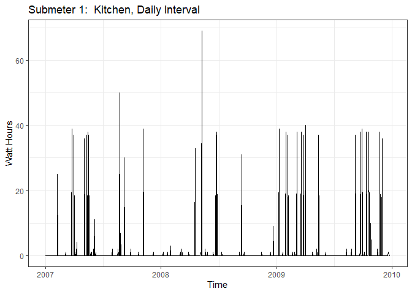<!-- -->

#### Fit to time series linear regression 

```r
library(tseries)

fitSM1 <- tslm(tsSM1_070809Daily ~ trend + season)
summary(fitSM1)
```

```
## 
## Call:
## tslm(formula = tsSM1_070809Daily ~ trend + season)
## 
## Residuals:
##     Min      1Q  Median      3Q     Max 
## -23.311  -0.311   0.000   0.311  46.000 
## 
## Coefficients:
##               Estimate Std. Error t value Pr(>|t|)    
## (Intercept) -0.3122719  3.7929359  -0.082  0.93441    
## trend        0.0008532  0.0006682   1.277  0.20207    
## season2     -0.0008532  5.3528589   0.000  0.99987    
## season3     -0.0017064  5.3528590   0.000  0.99975    
## season4     -0.0025596  5.3528592   0.000  0.99962    
## season5     -0.0034128  5.3528595  -0.001  0.99949    
## season6     -0.0042660  5.3528599  -0.001  0.99936    
## season7      0.3282141  5.3528603   0.061  0.95112    
## season8     -0.0059724  5.3528609  -0.001  0.99911    
## season9     12.9931744  5.3528615   2.427  0.01545 *  
## season10    -0.0076788  5.3528622  -0.001  0.99886    
## season11    -0.0085320  5.3528630  -0.002  0.99873    
## season12    -0.0093852  5.3528639  -0.002  0.99860    
## season13    -0.0102384  5.3528648  -0.002  0.99847    
## season14    -0.0110916  5.3528659  -0.002  0.99835    
## season15    -0.0119448  5.3528670  -0.002  0.99822    
## season16    -0.0127980  5.3528682  -0.002  0.99809    
## season17    -0.0136512  5.3528695  -0.003  0.99797    
## season18    -0.0145044  5.3528709  -0.003  0.99784    
## season19    -0.0153576  5.3528724  -0.003  0.99771    
## season20     0.3171225  5.3528739   0.059  0.95277    
## season21     0.3162693  5.3528755   0.059  0.95290    
## season22    -0.0179172  5.3528772  -0.003  0.99733    
## season23    -0.0187704  5.3528790  -0.004  0.99720    
## season24    -0.0196236  5.3528809  -0.004  0.99708    
## season25    -0.0204768  5.3528829  -0.004  0.99695    
## season26    -0.0213300  5.3528849  -0.004  0.99682    
## season27    -0.0221832  5.3528870  -0.004  0.99669    
## season28    -0.0230365  5.3528892  -0.004  0.99657    
## season29    -0.0238897  5.3528915  -0.004  0.99644    
## season30    12.6419238  5.3528939   2.362  0.01846 *  
## season31     0.9744039  5.3528964   0.182  0.85561    
## season32    -0.0264493  5.3528989  -0.005  0.99606    
## season33    -0.0273025  5.3529015  -0.005  0.99593    
## season34    -0.0281557  5.3529043  -0.005  0.99580    
## season35    -0.0290089  5.3529071  -0.005  0.99568    
## season36    11.9701379  5.3529099   2.236  0.02564 *  
## season37    12.3026181  5.3529129   2.298  0.02183 *  
## season38     8.3017649  5.3529159   1.551  0.12137    
## season39    -0.0324217  5.3529191  -0.006  0.99517    
## season40    -0.0332749  5.3529223  -0.006  0.99504    
## season41    -0.0341281  5.3529256  -0.006  0.99491    
## season42    -0.0349813  5.3529289  -0.007  0.99479    
## season43    -0.0358345  5.3529324  -0.007  0.99466    
## season44    -0.0366877  5.3529360  -0.007  0.99453    
## season45    -0.0375409  5.3529396  -0.007  0.99441    
## season46    -0.0383941  5.3529433  -0.007  0.99428    
## season47    -0.0392473  5.3529471  -0.007  0.99415    
## season48    -0.0401005  5.3529510  -0.007  0.99402    
## season49    -0.0409537  5.3529549  -0.008  0.99390    
## season50    -0.0418069  5.3529590  -0.008  0.99377    
## season51     0.2906732  5.3529631   0.054  0.95671    
## season52    -0.0435133  5.3529673  -0.008  0.99352    
## season53    -0.0443665  5.3529716  -0.008  0.99339    
## season54    -0.0452197  5.3529760  -0.008  0.99326    
## season55    -0.0460729  5.3529805  -0.009  0.99314    
## season56    -0.0469261  5.3529850  -0.009  0.99301    
## season57    -0.0477793  5.3529896  -0.009  0.99288    
## season58     0.2847008  5.3529943   0.053  0.95760    
## season59    -0.0494857  5.3529991  -0.009  0.99263    
## season60    -0.0503389  5.3530040  -0.009  0.99250    
## season61    -0.0511921  5.3530090  -0.010  0.99237    
## season62     0.2812880  5.3530140   0.053  0.95811    
## season63    -0.0528985  5.3530192  -0.010  0.99212    
## season64     0.2795816  5.3530244   0.052  0.95836    
## season65    12.6120617  5.3530297   2.356  0.01874 *  
## season66     0.6112085  5.3530351   0.114  0.90913    
## season67    -0.0563113  5.3530405  -0.011  0.99161    
## season68    -0.0571645  5.3530461  -0.011  0.99148    
## season69    -0.0580177  5.3530517  -0.011  0.99136    
## season70    -0.0588709  5.3530574  -0.011  0.99123    
## season71    -0.0597241  5.3530632  -0.011  0.99110    
## season72    -0.0605773  5.3530691  -0.011  0.99097    
## season73    -0.0614305  5.3530750  -0.011  0.99085    
## season74    -0.0622837  5.3530811  -0.012  0.99072    
## season75    -0.0631369  5.3530872  -0.012  0.99059    
## season76    -0.0639901  5.3530934  -0.012  0.99047    
## season77    -0.0648433  5.3530997  -0.012  0.99034    
## season78    12.6009701  5.3531061   2.354  0.01884 *  
## season79    -0.0665497  5.3531126  -0.012  0.99008    
## season80    -0.0674029  5.3531191  -0.013  0.98996    
## season81    -0.0682562  5.3531258  -0.013  0.98983    
## season82    -0.0691094  5.3531325  -0.013  0.98970    
## season83    -0.0699626  5.3531393  -0.013  0.98958    
## season84    12.9291842  5.3531462   2.415  0.01597 *  
## season85    -0.0716690  5.3531531  -0.013  0.98932    
## season86    12.2608112  5.3531602   2.290  0.02229 *  
## season87    -0.0733754  5.3531673  -0.014  0.98907    
## season88     0.2591048  5.3531745   0.048  0.96141    
## season89    -0.0750818  5.3531818  -0.014  0.98881    
## season90    12.2573984  5.3531892   2.290  0.02232 *  
## season91    -0.0767882  5.3531967  -0.014  0.98856    
## season92    13.2556920  5.3532042   2.476  0.01351 *  
## season93    -0.0784946  5.3532118  -0.015  0.98831    
## season94     0.2539856  5.3532196   0.047  0.96217    
## season95    -0.0802010  5.3532274  -0.015  0.98805    
## season96    -0.0810542  5.3532352  -0.015  0.98792    
## season97    -0.0819074  5.3532432  -0.015  0.98780    
## season98    -0.0827606  5.3532513  -0.015  0.98767    
## season99     1.2497195  5.3532594   0.233  0.81548    
## season100   -0.0844670  5.3532676  -0.016  0.98742    
## season101   -0.0853202  5.3532759  -0.016  0.98729    
## season102   -0.0861734  5.3532843  -0.016  0.98716    
## season103   -0.0870266  5.3532928  -0.016  0.98703    
## season104   -0.0878798  5.3533013  -0.016  0.98691    
## season105   -0.0887330  5.3533099  -0.017  0.98678    
## season106   -0.0895862  5.3533187  -0.017  0.98665    
## season107   -0.0904394  5.3533275  -0.017  0.98653    
## season108   10.9087074  5.3533363   2.038  0.04194 *  
## season109   -0.0921458  5.3533453  -0.017  0.98627    
## season110   -0.0929990  5.3533544  -0.017  0.98614    
## season111   -0.0938522  5.3533635  -0.018  0.98602    
## season112   -0.0947054  5.3533727  -0.018  0.98589    
## season113   -0.0955586  5.3533820  -0.018  0.98576    
## season114    0.2369215  5.3533914   0.044  0.96471    
## season115   -0.0972650  5.3534009  -0.018  0.98551    
## season116   -0.0981182  5.3534104  -0.018  0.98538    
## season117   -0.0989714  5.3534200  -0.018  0.98526    
## season118   -0.0998246  5.3534298  -0.019  0.98513    
## season119   -0.1006778  5.3534396  -0.019  0.98500    
## season120   -0.1015310  5.3534494  -0.019  0.98487    
## season121   -0.1023842  5.3534594  -0.019  0.98475    
## season122   -0.1032374  5.3534695  -0.019  0.98462    
## season123   11.8959094  5.3534796   2.222  0.02659 *  
## season124    0.5617228  5.3534898   0.105  0.91646    
## season125   -0.1057970  5.3535001  -0.020  0.98424    
## season126    0.2266831  5.3535105   0.042  0.96624    
## season127   -0.1075034  5.3535210  -0.020  0.98398    
## season128    0.5583100  5.3535315   0.104  0.91697    
## season129   22.8907902  5.3535421   4.276 2.16e-05 ***
## season130   -0.1100630  5.3535529  -0.021  0.98360    
## season131   12.2224171  5.3535637   2.283  0.02272 *  
## season132   -0.1117694  5.3535745  -0.021  0.98335    
## season133   -0.1126226  5.3535855  -0.021  0.98322    
## season134   12.2198575  5.3535966   2.283  0.02275 *  
## season135   12.5523376  5.3536077   2.345  0.01931 *  
## season136   -0.1151823  5.3536189  -0.022  0.98284    
## season137   12.2172979  5.3536302   2.282  0.02278 *  
## season138   -0.1168887  5.3536416  -0.022  0.98259    
## season139   -0.1177419  5.3536531  -0.022  0.98246    
## season140    0.5480716  5.3536646   0.102  0.91849    
## season141   -0.1194483  5.3536763  -0.022  0.98221    
## season142   -0.1203015  5.3536880  -0.022  0.98208    
## season143   -0.1211547  5.3536998  -0.023  0.98195    
## season144    0.2113255  5.3537117   0.039  0.96852    
## season145   -0.1228611  5.3537236  -0.023  0.98170    
## season146    0.2096191  5.3537357   0.039  0.96878    
## season147    0.2087659  5.3537478   0.039  0.96891    
## season148   -0.1254207  5.3537600  -0.023  0.98132    
## season149   -0.1262739  5.3537723  -0.024  0.98119    
## season150   -0.1271271  5.3537847  -0.024  0.98106    
## season151   -0.1279803  5.3537972  -0.024  0.98094    
## season152    0.5378332  5.3538097   0.100  0.92001    
## season153   -0.1296867  5.3538224  -0.024  0.98068    
## season154    0.2027934  5.3538351   0.038  0.96980    
## season155    3.5352736  5.3538479   0.660  0.50926    
## season156    0.2010870  5.3538608   0.038  0.97005    
## season157   -0.1330995  5.3538738  -0.025  0.98017    
## season158   -0.1339527  5.3538868  -0.025  0.98005    
## season159    0.1985274  5.3538999   0.037  0.97043    
## season160   -0.1356591  5.3539132  -0.025  0.97979    
## season161   -0.1365123  5.3539265  -0.025  0.97967    
## season162   -0.1373655  5.3539399  -0.026  0.97954    
## season163   -0.1382187  5.3539533  -0.026  0.97941    
## season164   -0.1390719  5.3539669  -0.026  0.97928    
## season165    0.1934082  5.3539805   0.036  0.97119    
## season166   -0.1407783  5.3539942  -0.026  0.97903    
## season167   -0.1416315  5.3540080  -0.026  0.97890    
## season168   -0.1424847  5.3540219  -0.027  0.97878    
## season169   -0.1433379  5.3540359  -0.027  0.97865    
## season170   -0.1441911  5.3540499  -0.027  0.97852    
## season171   -0.1450443  5.3540641  -0.027  0.97840    
## season172   -0.1458975  5.3540783  -0.027  0.97827    
## season173   -0.1467507  5.3540926  -0.027  0.97814    
## season174   12.1857294  5.3541070   2.276  0.02314 *  
## season175   -0.1484571  5.3541215  -0.028  0.97789    
## season176   -0.1493103  5.3541360  -0.028  0.97776    
## season177   12.5165031  5.3541506   2.338  0.01967 *  
## season178   -0.1510167  5.3541654  -0.028  0.97751    
## season179   -0.1518699  5.3541802  -0.028  0.97738    
## season180   -0.1527231  5.3541950  -0.029  0.97725    
## season181   -0.1535763  5.3542100  -0.029  0.97713    
## season182   -0.1544295  5.3542251  -0.029  0.97700    
## season183   -0.1552827  5.3542402  -0.029  0.97687    
## season184   -0.1561359  5.3542554  -0.029  0.97674    
## season185   -0.1569891  5.3542707  -0.029  0.97662    
## season186   -0.1578423  5.3542861  -0.029  0.97649    
## season187   -0.1586955  5.3543016  -0.030  0.97636    
## season188   -0.1595488  5.3543171  -0.030  0.97624    
## season189   -0.1604020  5.3543328  -0.030  0.97611    
## season190   -0.1612552  5.3543485  -0.030  0.97598    
## season191   -0.1621084  5.3543643  -0.030  0.97586    
## season192    0.1703718  5.3543802   0.032  0.97463    
## season193   -0.1638148  5.3543962  -0.031  0.97560    
## season194   -0.1646680  5.3544122  -0.031  0.97547    
## season195   -0.1655212  5.3544283  -0.031  0.97535    
## season196   -0.1663744  5.3544446  -0.031  0.97522    
## season197   -0.1672276  5.3544609  -0.031  0.97509    
## season198   -0.1680808  5.3544773  -0.031  0.97497    
## season199   -0.1689340  5.3544937  -0.032  0.97484    
## season200   -0.1697872  5.3545103  -0.032  0.97471    
## season201   -0.1706404  5.3545269  -0.032  0.97459    
## season202   -0.1714936  5.3545436  -0.032  0.97446    
## season203   -0.1723468  5.3545604  -0.032  0.97433    
## season204   -0.1732000  5.3545773  -0.032  0.97420    
## season205   -0.1740532  5.3545943  -0.033  0.97408    
## season206   -0.1749064  5.3546113  -0.033  0.97395    
## season207   -0.1757596  5.3546285  -0.033  0.97382    
## season208   -0.1766128  5.3546457  -0.033  0.97370    
## season209   -0.1774660  5.3546630  -0.033  0.97357    
## season210   -0.1783192  5.3546804  -0.033  0.97344    
## season211    0.4874943  5.3546979   0.091  0.92749    
## season212   -0.1800256  5.3547154  -0.034  0.97319    
## season213   -0.1808788  5.3547331  -0.034  0.97306    
## season214   -0.1817320  5.3547508  -0.034  0.97294    
## season215   -0.1825852  5.3547686  -0.034  0.97281    
## season216   -0.1834384  5.3547865  -0.034  0.97268    
## season217   -0.1842916  5.3548044  -0.034  0.97255    
## season218   -0.1851448  5.3548225  -0.035  0.97243    
## season219   -0.1859980  5.3548406  -0.035  0.97230    
## season220   -0.1868512  5.3548588  -0.035  0.97217    
## season221   -0.1877044  5.3548771  -0.035  0.97205    
## season222    0.4781091  5.3548955   0.089  0.92888    
## season223   -0.1894108  5.3549140  -0.035  0.97179    
## season224   -0.1902640  5.3549326  -0.036  0.97167    
## season225   -0.1911172  5.3549512  -0.036  0.97154    
## season226   -0.1919704  5.3549699  -0.036  0.97141    
## season227   -0.1928236  5.3549887  -0.036  0.97129    
## season228   -0.1936768  5.3550076  -0.036  0.97116    
## season229    0.1388033  5.3550266   0.026  0.97933    
## season230    0.4712834  5.3550456   0.088  0.92990    
## season231   -0.1962364  5.3550648  -0.037  0.97078    
## season232   -0.1970896  5.3550840  -0.037  0.97065    
## season233   -0.1979428  5.3551033  -0.037  0.97052    
## season234   -0.1987960  5.3551227  -0.037  0.97040    
## season235   16.4670174  5.3551421   3.075  0.00218 ** 
## season236   -0.2005024  5.3551617  -0.037  0.97014    
## season237    0.4653110  5.3551813   0.087  0.93078    
## season238    2.1311245  5.3552010   0.398  0.69078    
## season239   -0.2030620  5.3552208  -0.038  0.96976    
## season240   -0.2039152  5.3552407  -0.038  0.96964    
## season241   -0.2047685  5.3552607  -0.038  0.96951    
## season242   -0.2056217  5.3552808  -0.038  0.96938    
## season243   -0.2064749  5.3553009  -0.039  0.96926    
## season244   -0.2073281  5.3553211  -0.039  0.96913    
## season245   -0.2081813  5.3553414  -0.039  0.96900    
## season246   -0.2090345  5.3553618  -0.039  0.96888    
## season247   -0.2098877  5.3553823  -0.039  0.96875    
## season248   -0.2107409  5.3554028  -0.039  0.96862    
## season249   10.1217393  5.3554235   1.890  0.05916 .  
## season250   12.1208861  5.3554442   2.263  0.02391 *  
## season251    0.1200329  5.3554650   0.022  0.98212    
## season252   -0.2141537  5.3554859  -0.040  0.96811    
## season253   -0.2150069  5.3555068  -0.040  0.96799    
## season254   -0.2158601  5.3555279  -0.040  0.96786    
## season255   10.1166201  5.3555490   1.889  0.05929 .  
## season256   -0.2175665  5.3555702  -0.041  0.96761    
## season257   -0.2184197  5.3555915  -0.041  0.96748    
## season258   -0.2192729  5.3556129  -0.041  0.96735    
## season259   -0.2201261  5.3556344  -0.041  0.96723    
## season260   -0.2209793  5.3556559  -0.041  0.96710    
## season261   -0.2218325  5.3556776  -0.041  0.96697    
## season262   -0.2226857  5.3556993  -0.042  0.96685    
## season263    0.1097944  5.3557211   0.021  0.98365    
## season264    0.1089412  5.3557430   0.020  0.98378    
## season265   12.4414214  5.3557650   2.323  0.02046 *  
## season266   -0.2260985  5.3557870  -0.042  0.96634    
## season267   -0.2269517  5.3558091  -0.042  0.96621    
## season268   -0.2278049  5.3558314  -0.043  0.96608    
## season269   -0.2286581  5.3558537  -0.043  0.96596    
## season270    0.4371554  5.3558760   0.082  0.93497    
## season271   12.7696355  5.3558985   2.384  0.01737 *  
## season272   -0.2312177  5.3559211  -0.043  0.96558    
## season273   -0.2320709  5.3559437  -0.043  0.96545    
## season274   -0.2329241  5.3559664  -0.043  0.96532    
## season275   -0.2337773  5.3559892  -0.044  0.96520    
## season276   -0.2346305  5.3560121  -0.044  0.96507    
## season277   -0.2354837  5.3560351  -0.044  0.96494    
## season278    0.0969964  5.3560581   0.018  0.98556    
## season279   -0.2371901  5.3560813  -0.044  0.96469    
## season280   -0.2380433  5.3561045  -0.044  0.96456    
## season281   -0.2388965  5.3561278  -0.045  0.96444    
## season282   -0.2397497  5.3561512  -0.045  0.96431    
## season283   -0.2406029  5.3561746  -0.045  0.96418    
## season284   -0.2414561  5.3561982  -0.045  0.96406    
## season285   12.4243573  5.3562218   2.320  0.02064 *  
## season286   -0.2431625  5.3562455  -0.045  0.96380    
## season287   -0.2440157  5.3562693  -0.046  0.96368    
## season288   -0.2448689  5.3562932  -0.046  0.96355    
## season289   -0.2457221  5.3563172  -0.046  0.96342    
## season290   -0.2465753  5.3563412  -0.046  0.96330    
## season291    0.4192381  5.3563654   0.078  0.93764    
## season292   12.4183849  5.3563896   2.318  0.02070 *  
## season293    0.0841984  5.3564139   0.016  0.98746    
## season294    0.0833452  5.3564383   0.016  0.98759    
## season295   -0.2508414  5.3564627  -0.047  0.96266    
## season296   -0.2516946  5.3564873  -0.047  0.96254    
## season297   -0.2525478  5.3565119  -0.047  0.96241    
## season298    3.0799324  5.3565366   0.575  0.56548    
## season299   -0.2542542  5.3565614  -0.047  0.96215    
## season300   -0.2551074  5.3565863  -0.048  0.96203    
## season301   -0.2559606  5.3566113  -0.048  0.96190    
## season302   -0.2568138  5.3566363  -0.048  0.96177    
## season303   -0.2576670  5.3566615  -0.048  0.96165    
## season304   -0.2585202  5.3566867  -0.048  0.96152    
## season305   -0.2593734  5.3567120  -0.048  0.96139    
## season306   -0.2602266  5.3567374  -0.049  0.96127    
## season307   -0.2610798  5.3567628  -0.049  0.96114    
## season308   -0.2619330  5.3567884  -0.049  0.96101    
## season309   12.7372138  5.3568140   2.378  0.01768 *  
## season310   -0.2636394  5.3568397  -0.049  0.96076    
## season311   -0.2644926  5.3568655  -0.049  0.96063    
## season312   -0.2653458  5.3568914  -0.050  0.96051    
## season313   -0.2661990  5.3569174  -0.050  0.96038    
## season314   -0.2670522  5.3569434  -0.050  0.96025    
## season315   -0.2679054  5.3569695  -0.050  0.96013    
## season316   -0.2687586  5.3569958  -0.050  0.96000    
## season317   -0.2696118  5.3570221  -0.050  0.95987    
## season318    0.0628683  5.3570484   0.012  0.99064    
## season319   -0.2713182  5.3570749  -0.051  0.95962    
## season320    0.3944953  5.3571014   0.074  0.94132    
## season321   -0.2730246  5.3571281  -0.051  0.95937    
## season322   -0.2738778  5.3571548  -0.051  0.95924    
## season323   -0.2747310  5.3571816  -0.051  0.95911    
## season324   -0.2755842  5.3572085  -0.051  0.95899    
## season325   -0.2764374  5.3572354  -0.052  0.95886    
## season326   -0.2772906  5.3572625  -0.052  0.95873    
## season327   12.3885229  5.3572896   2.312  0.02103 *  
## season328   -0.2789970  5.3573168  -0.052  0.95848    
## season329   -0.2798502  5.3573441  -0.052  0.95835    
## season330   -0.2807034  5.3573715  -0.052  0.95823    
## season331   -0.2815566  5.3573990  -0.053  0.95810    
## season332   -0.2824098  5.3574265  -0.053  0.95797    
## season333   -0.2832630  5.3574541  -0.053  0.95785    
## season334   11.7158838  5.3574818   2.187  0.02907 *  
## season335   -0.2849694  5.3575096  -0.053  0.95759    
## season336   -0.2858226  5.3575375  -0.053  0.95747    
## season337   -0.2866758  5.3575655  -0.054  0.95734    
## season338   -0.2875290  5.3575935  -0.054  0.95721    
## season339   -0.2883822  5.3576217  -0.054  0.95709    
## season340   -0.2892354  5.3576499  -0.054  0.95696    
## season341    0.0432447  5.3576782   0.008  0.99356    
## season342   -0.2909418  5.3577065  -0.054  0.95671    
## season343   -0.2917950  5.3577350  -0.054  0.95658    
## season344   -0.2926482  5.3577635  -0.055  0.95646    
## season345   -0.2935014  5.3577922  -0.055  0.95633    
## season346    0.0389787  5.3578209   0.007  0.99420    
## season347   -0.2952078  5.3578497  -0.055  0.95608    
## season348   -0.2960611  5.3578785  -0.055  0.95595    
## season349   -0.2969143  5.3579075  -0.055  0.95582    
## season350   -0.2977675  5.3579366  -0.056  0.95570    
## season351   -0.2986207  5.3579657  -0.056  0.95557    
## season352   -0.2994739  5.3579949  -0.056  0.95544    
## season353   -0.3003271  5.3580242  -0.056  0.95532    
## season354    0.0321531  5.3580536   0.006  0.99521    
## season355    2.6979665  5.3580830   0.504  0.61474    
## season356   -0.3028867  5.3581126  -0.057  0.95494    
## season357   -0.3037399  5.3581422  -0.057  0.95481    
## season358   -0.3045931  5.3581719  -0.057  0.95468    
## season359   -0.3054463  5.3582017  -0.057  0.95456    
## season360   -0.3062995  5.3582316  -0.057  0.95443    
## season361   -0.1514433  5.9858533  -0.025  0.97982    
## season362   -0.1522965  5.9858666  -0.025  0.97971    
## season363   -0.1531497  5.9858800  -0.026  0.97960    
## season364   -0.1540029  5.9858934  -0.026  0.97948    
## season365   -0.1548561  5.9859069  -0.026  0.97937    
## ---
## Signif. codes:  0 '***' 0.001 '**' 0.01 '*' 0.05 '.' 0.1 ' ' 1
## 
## Residual standard error: 6.556 on 724 degrees of freedom
## Multiple R-squared:  0.3132,	Adjusted R-squared:  -0.03299 
## F-statistic: 0.9047 on 365 and 724 DF,  p-value: 0.8613
```

#### Observations
R2 = 0.3132 and RMSE = 6.556
There is quite low R2 (accuracy), which isn't uncommon in time series forecasting, especially if predictions are based off of longer, highly seasonal time frames. RMSE is the error rate, which decent. We will plot next to visualize. 


```r
# create forecast for 25 days into 2010
forecastfitSM1 <- forecast(fitSM1, h=25)
plot(forecastfitSM1, xlim = c(2009.7, 2010.07), ylim = c(0, 40), xlab = 'Weeks', ylab = 'Watts', main = 'Submeter 1: 25 Day Forecast from LM Model') 
```

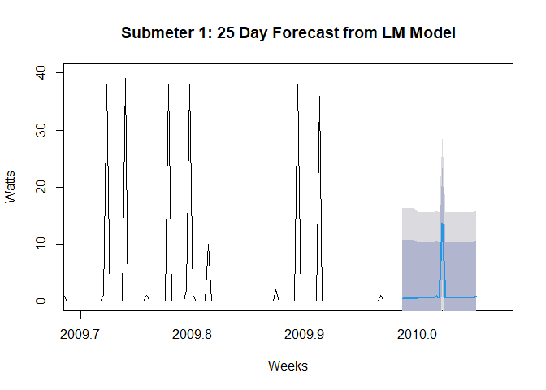<!-- -->


```r
## closer view of 25 day forecast into 2010
forecastfitSM1 <- forecast(fitSM1, h=25)
plot(forecastfitSM1, xlim = c(2009.98, 2010.06), ylim = c(0, 30), xlab = 'Weeks', ylab = 'Watts', main = 'Submeter 1: 25-Day Forecast from LM Model') 
```

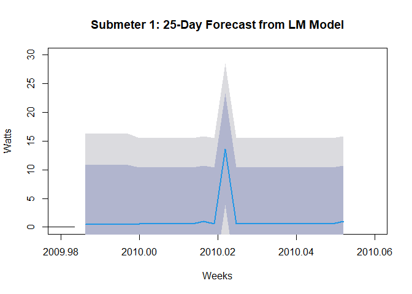<!-- -->

#### Observations
Forecast for energy use with submeter 1 Kitchen is on average quite low for 25 days, with one spike about midway. The 75 and 90% confidence shadings showcase the variation in predictions. This variation is likely due to the long time frame from which predictions were based (2007 to 2010), which included much seasonality. 


#### Decompose time series into trend, seasonal, random, then plot and summarize

```r
components070809SM1daily <- decompose(tsSM1_070809Daily)
# decomposition visualization with analysis
plot(components070809SM1daily)
```

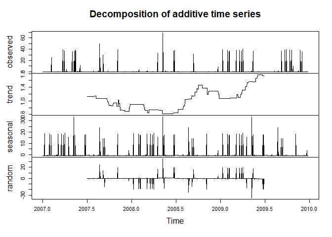<!-- -->

```r
summary(components070809SM1daily)  
```

```
##          Length Class  Mode     
## x        1090   ts     numeric  
## seasonal 1090   ts     numeric  
## trend    1090   ts     numeric  
## random   1090   ts     numeric  
## figure    365   -none- numeric  
## type        1   -none- character
```

#### Trend reveals steady decline from 1.1 in mid-2007 to low 0.6 mid-2008 then rise to 1.8 mid-2009
#### Seasonality is hard to view

## Holt Winters Forecasting - Exponential Smoothing

```r
# first subtract the seasonal component removed in prior step
tsSM1_070809Adjusted <- tsSM1_070809Daily - components070809SM1daily$seasonal
autoplot(tsSM1_070809Adjusted)
```

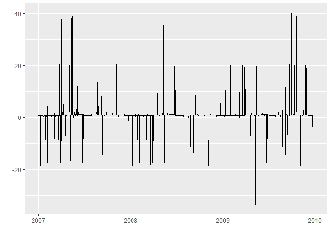<!-- -->
 

```r
# test seasonal adjustment by running Decompose again, note the extremely small scale in seasonal line
plot(decompose(tsSM1_070809Adjusted))
```

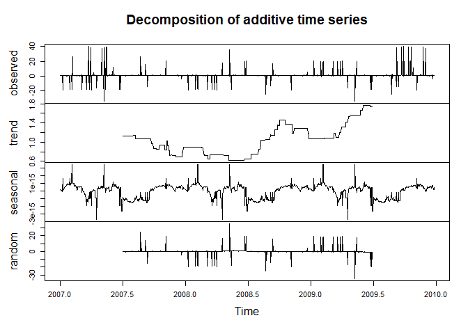<!-- -->


```r
# holt winters exponential smoothing
tsSM1_HW <- HoltWinters(tsSM1_070809Daily)
plot(tsSM1_HW, ylim = c(0, 40))
```

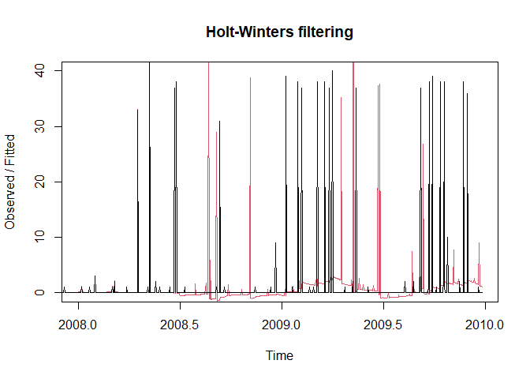<!-- -->


```r
# holt winters 25-day forecast
tsSM1_HWforecast <- forecast(tsSM1_HW, h=25)
plot(tsSM1_HWforecast, ylim = c(0, 40), xlim = c(2009.7,2010.06), ylab = 'Watts', xlab = 'Time', main = 'Submeter 1 Kitchen: Holt-Winters 25 Day Forecast')
```

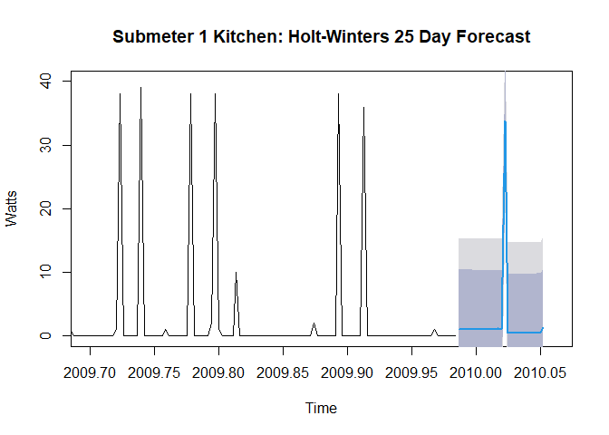<!-- -->


```r
# forecast holt winters with diminished confidence levels
tsSM1_HWforecast_C <- forecast(tsSM1_HW, h=25, level = c(10,25))
plot(tsSM1_HWforecast_C, ylim = c(0, 30), ylab = 'Watts', xlab = 'Time', main = 'Submeter 1 Kitchen: Holt-Winters 25 Day Forecast, 25-50% CI', start(2010))
```

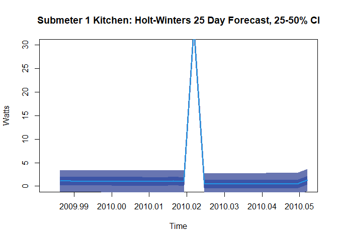<!-- -->

#### Observations
* Submeter 1 25-day forecast with seasonality removed projected at about 2 Watts on average each day with a large spike at about day 13


```r
# change wday and month from numbers to labels for next forecast
subMeters$wday <- wday(subMeters$DateTime, label=TRUE)
subMeters$month <- month(subMeters$DateTime, label=FALSE)
subMeters$day <- wday(subMeters$DateTime, label=TRUE)
```

## Submeter 3: Water Heater & AC

```r
# subset to one observation per week on Mondays at 8:00pm for 2007, 2008, 2009
house070809weekly <- filter(subMeters, wday=='Mon' & hour==20 & minute==0)
```


```r
# create time series object for submeter 3
tsSM3_070809weekly <- ts(house070809weekly$sub3, frequency = 52, start = c(2007,1))
tsSM3_070809weekly
```

```
## Time Series:
## Start = c(2007, 1) 
## End = c(2010, 1) 
## Frequency = 52 
##   [1] 17 17 17  0 17  0  0 17  0 17 18 17  0  0 18 18  0  0 17  0  0 17  0  0  0
##  [26]  9  0  0  0  0  0  0  0  0  0  0  0  0 17 17 18  0 18  0  0  0 17  0  0  0
##  [51] 17 18 17  0  0  0  0  0 17  0  0  0  0  0  0  0  1  1  1  1  0 18  0  0  1
##  [76]  1  0 12  0  0  0  1  0  0  1  1  1  0  0 18  0  1 12  0  0  0  0  0  0  0
## [101]  0  0  0  0 18  0  0  0  0  0  0 17  0  0  0  0  0  0  0  0  0  7  0  1  0
## [126] 18  6  0 19  1  0  1  1  0  1  1 19  0 11  1 12  0  0  1  0  0  1  1 18  0
## [151] 18  0  0 18 19  0 18
```


```r
# time Series Visualization Submeter 3
autoplot(tsSM3_070809weekly, ts.colour = 'black', xlab = 'Time', ylab = 'Watt Hours', main = 'Submeter 3:  Water Heater & AC, Weekly Interval', size = .7) +
           theme_bw()
```

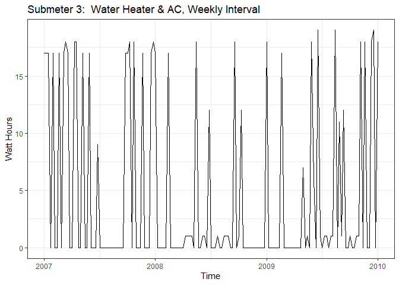<!-- -->


```r
# create time series linear regression
fitSM3 <- tslm(tsSM3_070809weekly ~ trend + season)
summary(fitSM3) #R2 and RMSE
```

```
## 
## Call:
## tslm(formula = tsSM3_070809weekly ~ trend + season)
## 
## Residuals:
##      Min       1Q   Median       3Q      Max 
## -12.0000  -4.4798  -0.3333   1.8536  13.8536 
## 
## Coefficients:
##              Estimate Std. Error t value Pr(>|t|)    
## (Intercept)  19.30320    3.68807   5.234 8.67e-07 ***
## trend        -0.02283    0.01316  -1.735  0.08574 .  
## season2     -12.40397    5.41525  -2.291  0.02401 *  
## season3     -12.38114    5.41447  -2.287  0.02424 *  
## season4     -18.02498    5.41372  -3.330  0.00120 ** 
## season5     -12.33549    5.41300  -2.279  0.02472 *  
## season6     -17.97933    5.41231  -3.322  0.00123 ** 
## season7     -12.28984    5.41165  -2.271  0.02521 *  
## season8      -6.60035    5.41103  -1.220  0.22530    
## season9     -17.91086    5.41044  -3.310  0.00128 ** 
## season10    -12.22136    5.40988  -2.259  0.02596 *  
## season11    -11.86520    5.40935  -2.193  0.03050 *  
## season12    -12.17571    5.40885  -2.251  0.02648 *  
## season13    -17.81955    5.40839  -3.295  0.00135 ** 
## season14    -17.79673    5.40796  -3.291  0.00136 ** 
## season15    -11.44057    5.40756  -2.116  0.03676 *  
## season16    -11.41775    5.40719  -2.112  0.03712 *  
## season17    -17.39492    5.40685  -3.217  0.00173 ** 
## season18    -15.03876    5.40655  -2.782  0.00642 ** 
## season19    -12.01594    5.40628  -2.223  0.02841 *  
## season20    -11.32644    5.40604  -2.095  0.03859 *  
## season21    -17.63695    5.40583  -3.263  0.00149 ** 
## season22     -5.94746    5.40565  -1.100  0.27377    
## season23    -15.25797    5.40551  -2.823  0.00571 ** 
## season24    -17.23514    5.40540  -3.189  0.00189 ** 
## season25    -11.21232    5.40532  -2.074  0.04052 *  
## season26    -10.18949    5.40527  -1.885  0.06221 .  
## season27    -17.50000    5.40525  -3.238  0.00162 ** 
## season28    -17.14384    5.40527  -3.172  0.00199 ** 
## season29    -17.12102    5.40532  -3.167  0.00202 ** 
## season30    -17.09819    5.40540  -3.163  0.00205 ** 
## season31    -17.07537    5.40551  -3.159  0.00207 ** 
## season32    -17.05254    5.40565  -3.155  0.00210 ** 
## season33    -10.69638    5.40583  -1.979  0.05050 .  
## season34    -17.00689    5.40604  -3.146  0.00216 ** 
## season35    -13.31740    5.40628  -2.463  0.01541 *  
## season36    -16.96124    5.40655  -3.137  0.00222 ** 
## season37    -13.27175    5.40685  -2.455  0.01576 *  
## season38    -11.24892    5.40719  -2.080  0.03995 *  
## season39    -11.55943    5.40756  -2.138  0.03489 *  
## season40    -10.86994    5.40796  -2.010  0.04702 *  
## season41     -7.18045    5.40839  -1.328  0.18720    
## season42    -17.15762    5.40885  -3.172  0.00199 ** 
## season43    -10.80146    5.40935  -1.997  0.04846 *  
## season44    -16.77864    5.40988  -3.101  0.00248 ** 
## season45    -11.08914    5.41044  -2.050  0.04292 *  
## season46    -17.06632    5.41103  -3.154  0.00211 ** 
## season47     -5.37683    5.41165  -0.994  0.32274    
## season48    -17.02067    5.41231  -3.145  0.00217 ** 
## season49    -16.99784    5.41300  -3.140  0.00220 ** 
## season50    -10.97502    5.41372  -2.027  0.04519 *  
## season51     -4.95219    5.41447  -0.915  0.36251    
## season52    -10.92937    5.41525  -2.018  0.04614 *  
## ---
## Signif. codes:  0 '***' 0.001 '**' 0.01 '*' 0.05 '.' 0.1 ' ' 1
## 
## Residual standard error: 7.077 on 104 degrees of freedom
## Multiple R-squared:  0.3581,	Adjusted R-squared:  0.03719 
## F-statistic: 1.116 on 52 and 104 DF,  p-value: 0.3141
```


```r
# create forecast, then plot
forecastfitSM3 <- forecast(fitSM3, h=10)
plot(forecastfitSM3) 
```

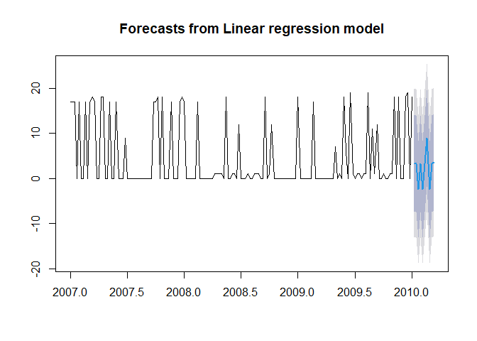<!-- -->

#### Forecast time series linear regression with confidence levels 80 and 90%

```r
forecastfitSM3c <- forecast(fitSM3, h=10, level=c(25,50))
forecastfitSM3
```

```
##          Point Forecast      Lo 80     Hi 80      Lo 95    Hi 95
## 2010.019       3.292835  -7.393656 13.979326 -13.138100 19.72377
## 2010.038       3.292835  -7.393656 13.979326 -13.138100 19.72377
## 2010.058      -2.373832 -13.060323  8.312659 -18.804767 14.05710
## 2010.077       3.292835  -7.393656 13.979326 -13.138100 19.72377
## 2010.096      -2.373832 -13.060323  8.312659 -18.804767 14.05710
## 2010.115       3.292835  -7.393656 13.979326 -13.138100 19.72377
## 2010.135       8.959502  -1.726990 19.645993  -7.471433 25.39044
## 2010.154      -2.373832 -13.060323  8.312659 -18.804767 14.05710
## 2010.173       3.292835  -7.393656 13.979326 -13.138100 19.72377
## 2010.192       3.626168  -7.060323 14.312659 -12.804767 20.05710
```

```r
# Linear Regression Forecast Visualization
plot(forecastfitSM3c, ylim = c(0, 20), xlim = c(2009.5,2010.2), ylab = 'Watt-Hours', xlab = 'Time', main = 'Submeter 3: Water Heater & AC 10-Week Seasonal Forecast')
```

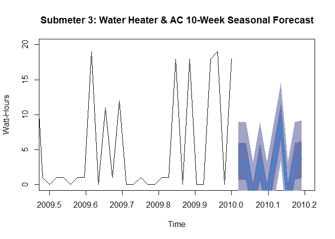<!-- -->

#### Decompose time series linear regression

```r
# remove seasonal component to analyze trend independently
components070809SM3weekly <- decompose(tsSM3_070809weekly)
plot(components070809SM3weekly)
```

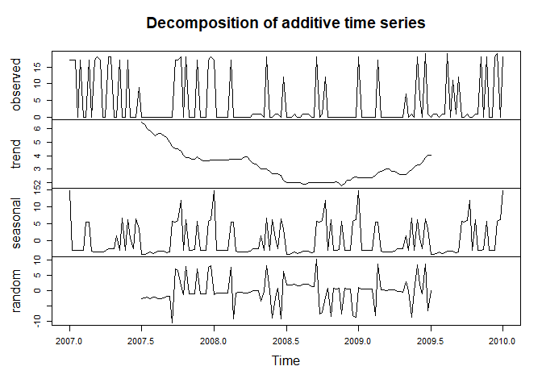<!-- -->

```r
summary(components070809SM3weekly)
```

```
##          Length Class  Mode     
## x        157    ts     numeric  
## seasonal 157    ts     numeric  
## trend    157    ts     numeric  
## random   157    ts     numeric  
## figure    52    -none- numeric  
## type       1    -none- character
```

#### Trend reveals power use steady decline from high of 6 mid-2007 to low of 2 late-2008, then picked back up
#### Seasonal effects shows decreased use Q3 and peak use Q1 and Q2

```r
components070809SM3weekly$seasonal 
```

```
## Time Series:
## Start = c(2007, 1) 
## End = c(2010, 1) 
## Frequency = 52 
##   [1] 14.706762 -2.798046 -2.807661 -2.812469 -2.817277 -2.826892  5.576954
##   [8]  5.485608 -3.067277 -3.124969 -3.187469 -3.245161 -3.163431 -3.004777
##  [15] -2.341315 -2.254777 -2.173046  1.403877 -2.687469  6.725992 -2.778815
##  [22]  6.216377  0.716377 -2.370161  6.533685  3.610608 -3.963110 -3.961508
##  [29] -3.798046 -3.216315 -3.634585 -3.552854 -3.052854 -3.052854 -3.052854
##  [36] -3.471123 -3.302854  5.865415  5.447146  5.947146 12.033685 -2.793238
##  [43]  6.293300 -2.740354 -2.692277 -2.615354  5.879839 -2.624969 -2.658623
##  [50] -2.687469  5.721185  6.168300 14.706762 -2.798046 -2.807661 -2.812469
##  [57] -2.817277 -2.826892  5.576954  5.485608 -3.067277 -3.124969 -3.187469
##  [64] -3.245161 -3.163431 -3.004777 -2.341315 -2.254777 -2.173046  1.403877
##  [71] -2.687469  6.725992 -2.778815  6.216377  0.716377 -2.370161  6.533685
##  [78]  3.610608 -3.963110 -3.961508 -3.798046 -3.216315 -3.634585 -3.552854
##  [85] -3.052854 -3.052854 -3.052854 -3.471123 -3.302854  5.865415  5.447146
##  [92]  5.947146 12.033685 -2.793238  6.293300 -2.740354 -2.692277 -2.615354
##  [99]  5.879839 -2.624969 -2.658623 -2.687469  5.721185  6.168300 14.706762
## [106] -2.798046 -2.807661 -2.812469 -2.817277 -2.826892  5.576954  5.485608
## [113] -3.067277 -3.124969 -3.187469 -3.245161 -3.163431 -3.004777 -2.341315
## [120] -2.254777 -2.173046  1.403877 -2.687469  6.725992 -2.778815  6.216377
## [127]  0.716377 -2.370161  6.533685  3.610608 -3.963110 -3.961508 -3.798046
## [134] -3.216315 -3.634585 -3.552854 -3.052854 -3.052854 -3.052854 -3.471123
## [141] -3.302854  5.865415  5.447146  5.947146 12.033685 -2.793238  6.293300
## [148] -2.740354 -2.692277 -2.615354  5.879839 -2.624969 -2.658623 -2.687469
## [155]  5.721185  6.168300 14.706762
```

```r
components070809SM3weekly$trend
```

```
## Time Series:
## Start = c(2007, 1) 
## End = c(2010, 1) 
## Frequency = 52 
##   [1]       NA       NA       NA       NA       NA       NA       NA       NA
##   [9]       NA       NA       NA       NA       NA       NA       NA       NA
##  [17]       NA       NA       NA       NA       NA       NA       NA       NA
##  [25]       NA       NA 6.500000 6.336538 6.009615 5.846154 5.682692 5.519231
##  [33] 5.682692 5.682692 5.519231 5.355769 5.019231 4.682692 4.519231 4.519231
##  [41] 4.355769 4.028846 3.875000 3.894231 3.740385 3.750000 3.923077 3.759615
##  [49] 3.605769 3.625000 3.634615 3.663462 3.692308 3.692308 3.692308 3.701923
##  [57] 3.711538 3.711538 3.721154 3.740385 3.759615 3.769231 3.769231 3.942308
##  [65] 3.951923 3.634615 3.423077 3.365385 3.192308 3.019231 3.019231 3.019231
##  [73] 2.855769 2.692308 2.692308 2.692308 2.528846 2.192308 2.028846 2.038462
##  [81] 2.038462 2.038462 2.038462 2.038462 1.875000 1.875000 2.038462 2.038462
##  [89] 2.038462 2.038462 2.038462 2.038462 2.028846 2.009615 1.990385 2.038462
##  [97] 2.096154 1.932692 1.769231 1.942308 2.163462 2.201923 2.375000 2.451923
## [105] 2.346154 2.355769 2.375000 2.375000 2.375000 2.394231 2.576923 2.740385
## [113] 2.826923 2.932692 3.057692 3.000000 2.826923 2.826923 2.711538 2.596154
## [121] 2.605769 2.625000 2.807692 2.980769 3.153846 3.326923 3.326923 3.500000
## [129] 3.855769 4.038462 4.038462       NA       NA       NA       NA       NA
## [137]       NA       NA       NA       NA       NA       NA       NA       NA
## [145]       NA       NA       NA       NA       NA       NA       NA       NA
## [153]       NA       NA       NA       NA       NA
```

```r
components070809SM3weekly$random
```

```
## Time Series:
## Start = c(2007, 1) 
## End = c(2010, 1) 
## Frequency = 52 
##   [1]           NA           NA           NA           NA           NA
##   [6]           NA           NA           NA           NA           NA
##  [11]           NA           NA           NA           NA           NA
##  [16]           NA           NA           NA           NA           NA
##  [21]           NA           NA           NA           NA           NA
##  [26]           NA  -2.53688979  -2.37503082  -2.21156928  -2.62983851
##  [31]  -2.04810774  -1.96637697  -2.62983851  -2.62983851  -2.46637697
##  [36]  -1.88464620  -1.71637697 -10.54810774   7.03362303   6.53362303
##  [41]   1.61054610  -1.23560774   7.83169995  -1.15387697  -1.04810774
##  [46]  -1.13464620   7.19708457  -1.13464620  -0.94714620  -0.93753082
##  [51]   7.64419995   8.16823841  -1.39906928  -0.89426159  -0.88464620
##  [56]  -0.88945390  -0.89426159  -0.88464620   7.70189226  -9.22599236
##  [61]  -0.69233851  -0.64426159  -0.58176159  -0.69714620  -0.78849236
##  [66]  -0.62983851  -0.08176159  -0.11060774  -0.01926159  -3.42310774
##  [71]  -0.33176159   8.25477687  -0.07695390  -8.90868466  -2.40868466
##  [76]   0.67785380  -9.06253082   6.19708457   1.93426405   1.92304610
##  [81]   1.75958457   2.17785380   1.59612303   1.51439226   2.17785380
##  [86]   2.17785380   2.01439226   1.43266149   1.26439226  10.09612303
##  [91]  -7.48560774  -6.98560774  -2.06253082   0.78362303  -8.28368466
##  [96]   0.70189226   0.59612303   0.68266149  -7.64906928   0.68266149
## [101]   0.49516149   0.48554610  -8.09618466  -8.62022313   0.94708457
## [106]   0.44227687   0.43266149   0.43746918   0.44227687   0.43266149
## [111]  -8.15387697   8.77400764   0.24035380   0.19227687   0.12977687
## [116]   0.24516149   0.33650764   0.17785380  -0.37022313  -0.34137697
## [121]  -0.43272313   2.97112303  -0.12022313  -8.70676159  -0.37503082
## [126]   8.45669995   1.95669995  -1.12983851   8.61054610  -6.64906928
## [131]  -0.07535133           NA           NA           NA           NA
## [136]           NA           NA           NA           NA           NA
## [141]           NA           NA           NA           NA           NA
## [146]           NA           NA           NA           NA           NA
## [151]           NA           NA           NA           NA           NA
## [156]           NA           NA
```

## Holt Winters Forecasting Submeter 3 - Exponential Smoothing

```r
# first subtract the seasonal component removed in prior step
tsSM3_070809Adjusted <- tsSM3_070809weekly - components070809SM3weekly$seasonal
autoplot(tsSM3_070809Adjusted)
```

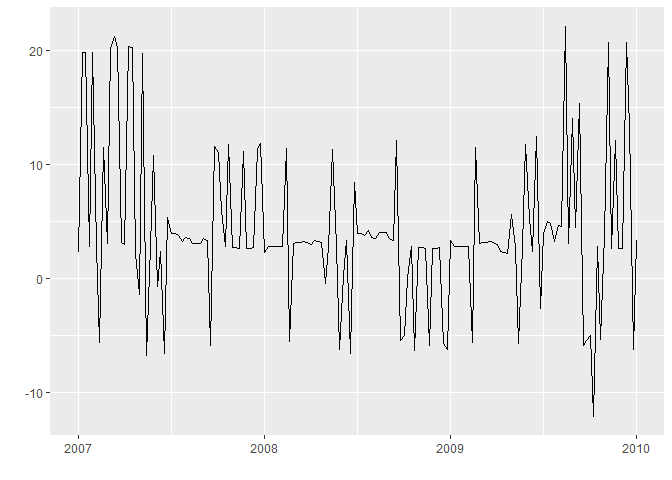<!-- -->


```r
# test seasonal adjustment by running decompose again, note extremely small scale in seasonal line
plot(decompose(tsSM3_070809Adjusted))
```

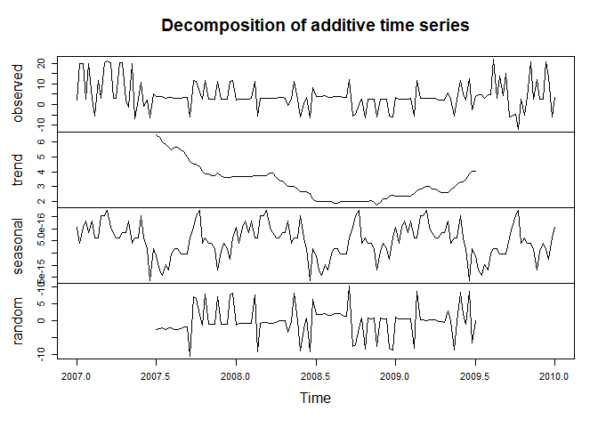<!-- -->

## Holt Winters Exponential Smoothing Submeter 3

```r
tsSM3_HW <- HoltWinters(tsSM3_070809weekly)
tsSM3_HW
```

```
## Holt-Winters exponential smoothing with trend and additive seasonal component.
## 
## Call:
## HoltWinters(x = tsSM3_070809weekly)
## 
## Smoothing parameters:
##  alpha: 0.04253373
##  beta : 0.07162345
##  gamma: 0.7791688
## 
## Coefficients:
##           [,1]
## a    6.2693527
## b    0.1224943
## s1  -0.6151156
## s2  -0.6503462
## s3  -0.6923040
## s4  -0.7398980
## s5  -0.7919094
## s6   3.4686884
## s7  12.3502534
## s8  -0.9629947
## s9  -1.0327521
## s10 -1.1042630
## s11 -1.1886987
## s12 -1.2669076
## s13 -1.3253802
## s14 -1.1320394
## s15 -1.1649135
## s16 -1.1879560
## s17  4.0158225
## s18 -1.7229321
## s19  3.5333707
## s20 -1.2540602
## s21 12.1444473
## s22  2.7972275
## s23 -1.8974084
## s24 12.0195803
## s25  0.9744834
## s26 -2.7660442
## s27 -2.1110797
## s28 -2.2231102
## s29 -2.8974341
## s30 -2.4053239
## s31 -2.5176600
## s32 10.9698958
## s33 -3.9221405
## s34  4.2098354
## s35 -3.8827452
## s36  4.2128137
## s37 -1.8036879
## s38 -3.8914845
## s39 -2.7519639
## s40 -1.1206271
## s41 -4.0484333
## s42 -2.1290100
## s43 -3.0059592
## s44  9.6905176
## s45 -4.3079081
## s46 10.2382668
## s47 -4.5606014
## s48 -4.4968868
## s49  8.9927329
## s50 10.2901226
## s51 -4.1150469
## s52 12.9367987
```

```r
plot(tsSM3_HW, ylim = c(0, 25))
```

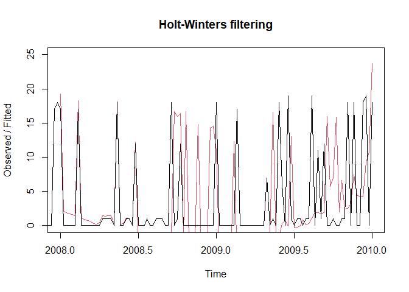<!-- -->


```r
# holt winters forecast submeter 3
tsSM3_HWforecast <- forecast(tsSM3_HW, h=10)
plot(tsSM3_HWforecast, ylim = c(0, 30), xlim = c(2009.7,2010.2), ylab = 'Watts', xlab = 'Time', main = 'Water Heater/AC: Holt-Winters 10-Week Forecast')
```

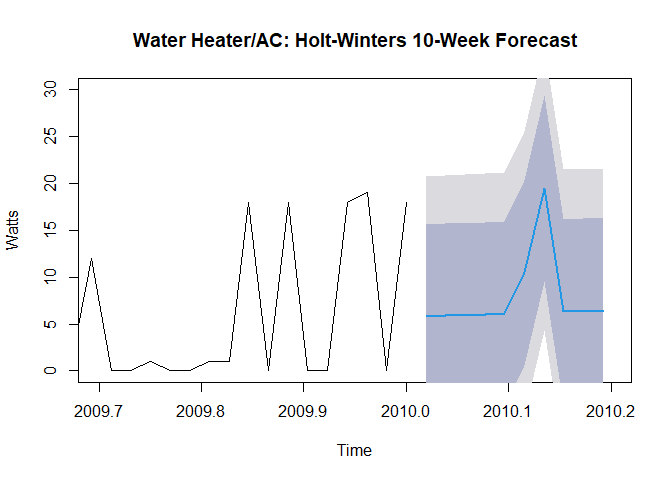<!-- -->


```r
# forecast Holt Winters with diminished confidence levels
tsSM3_HWforecast_C <- forecast(tsSM3_HW, h=10, level = c(25, 50))
plot(tsSM3_HWforecast_C, ylim = c(0, 30), ylab = 'Watts', xlab = 'Time', main = 'Water Heater/AC: Holt-Winters 10-Week Forecast, 25-50% CI', start(2010))
```

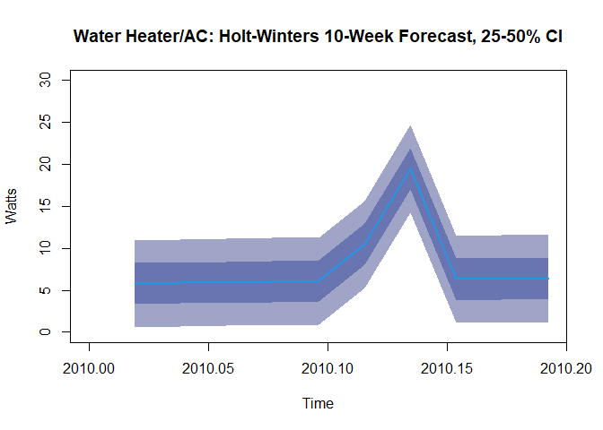<!-- -->

#### Observation
* Submeter 3 ten week regression forecast with seasonality removed projected at about 6 Watts typical with rise and peak about 7 weeks into 2010


## Submeter 2: Laundry
## Subset to one observation per day at 7:00pm for 2007, 2008, 2009

```r
house070809daily <- filter(subMeters, hour==19 & minute==0)
houseDec2009daily <- filter(subMeters, year==2009 & month==12 & minute==0)
# create time series object for submeter 2
tsSM2_070809daily <- ts(house070809daily$sub2, frequency = 31)
# time series visualization submeter 2
autoplot(tsSM2_070809daily, ts.colour = 'black', xlab = 'Time', ylab = 'Watt Hours', main = 'Submeter 2:  Laundry, Daily Interval') +
  theme_bw()
```

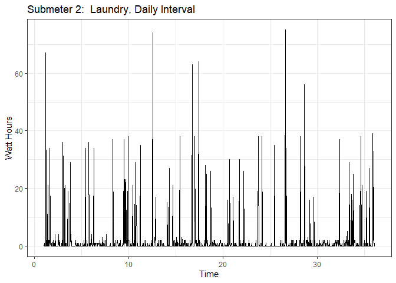<!-- -->


```r
# fit to time series linear regression, then summary to obtain R2 and RMSE
fitSM2 <- tslm(tsSM2_070809daily ~ trend + season)
summary(fitSM2)
```

```
## 
## Call:
## tslm(formula = tsSM2_070809daily ~ trend + season)
## 
## Residuals:
##    Min     1Q Median     3Q    Max 
## -6.082 -2.439 -1.281 -0.388 70.966 
## 
## Coefficients:
##               Estimate Std. Error t value Pr(>|t|)  
## (Intercept)  2.5306119  1.3727487   1.843   0.0655 .
## trend       -0.0002097  0.0007566  -0.277   0.7818  
## season2     -1.2220126  1.8522057  -0.660   0.5096  
## season3     -1.2495807  1.8522062  -0.675   0.5000  
## season4     -1.9715933  1.8522070  -1.064   0.2874  
## season5      0.0563942  1.8522081   0.030   0.9757  
## season6     -2.0760109  1.8654056  -1.113   0.2660  
## season7      3.1527702  1.8654026   1.690   0.0913 .
## season8      0.1244084  1.8653998   0.067   0.9468  
## season9     -1.8182390  1.8653973  -0.975   0.3299  
## season10    -0.4180294  1.8653952  -0.224   0.8227  
## season11    -1.1035340  1.8653934  -0.592   0.5543  
## season12    -0.9318958  1.8653918  -0.500   0.6175  
## season13    -1.2459719  1.8653906  -0.668   0.5043  
## season14     2.8685235  1.8653897   1.538   0.1244  
## season15    -1.2169811  1.8653891  -0.652   0.5143  
## season16    -1.0167715  1.8653888  -0.545   0.5858  
## season17    -0.3022761  1.8653888  -0.162   0.8713  
## season18     1.2693621  1.8653891   0.680   0.4963  
## season19    -2.0732854  1.8653897  -1.111   0.2666  
## season20     1.6697814  1.8653906   0.895   0.3709  
## season21     2.3842768  1.8653918   1.278   0.2015  
## season22    -0.6155136  1.8653934  -0.330   0.7415  
## season23     1.5846961  1.8653952   0.850   0.3958  
## season24     3.5563343  1.8653973   1.906   0.0569 .
## season25    -0.3577418  1.8653998  -0.192   0.8480  
## season26    -1.6718178  1.8654026  -0.896   0.3703  
## season27    -0.8716082  1.8654056  -0.467   0.6404  
## season28    -2.0428271  1.8654090  -1.095   0.2737  
## season29     0.1002397  1.8654127   0.054   0.9572  
## season30    -1.7281221  1.8654167  -0.926   0.3544  
## season31    -0.5279124  1.8654210  -0.283   0.7772  
## ---
## Signif. codes:  0 '***' 0.001 '**' 0.01 '*' 0.05 '.' 0.1 ' ' 1
## 
## Residual standard error: 7.858 on 1058 degrees of freedom
## Multiple R-squared:  0.0404,	Adjusted R-squared:  0.01228 
## F-statistic: 1.437 on 31 and 1058 DF,  p-value: 0.05832
```


```r
# create forecast
forecastfitSM2 <- forecast(fitSM2, h=25)
forecastfitSM2
```

```
##          Point Forecast      Lo 80    Hi 80      Lo 95    Hi 95
## 36.16129      0.2258720 -10.008438 10.46018 -15.434296 15.88604
## 36.19355      5.4544434  -4.779866 15.68875 -10.205725 21.11461
## 36.22581      2.4258720  -7.808438 12.66018 -13.234296 18.08604
## 36.25806      0.4830148  -9.751295 10.71732 -15.177153 16.14318
## 36.29032      1.8830148  -8.351295 12.11732 -13.777153 17.54318
## 36.32258      1.1973005  -9.037009 11.43161 -14.462867 16.85747
## 36.35484      1.3687291  -8.865580 11.60304 -14.291439 17.02890
## 36.38710      1.0544434  -9.179866 11.28875 -14.605725 16.71461
## 36.41935      5.1687291  -5.065580 15.40304 -10.491439 20.82890
## 36.45161      1.0830148  -9.151295 11.31732 -14.577153 16.74318
## 36.48387      1.2830148  -8.951295 11.51732 -14.377153 16.94318
## 36.51613      1.9973005  -8.237009 12.23161 -13.662867 17.65747
## 36.54839      3.5687291  -6.665580 13.80304 -12.091439 19.22890
## 36.58065      0.2258720 -10.008438 10.46018 -15.434296 15.88604
## 36.61290      3.9687291  -6.265580 14.20304 -11.691439 19.62890
## 36.64516      4.6830148  -5.551295 14.91732 -10.977153 20.34318
## 36.67742      1.6830148  -8.551295 11.91732 -13.977153 17.34318
## 36.70968      3.8830148  -6.351295 14.11732 -11.777153 19.54318
## 36.74194      5.8544434  -4.379866 16.08875  -9.805725 21.51461
## 36.77419      1.9401577  -8.294152 12.17447 -13.720010 17.60033
## 36.80645      0.6258720  -9.608438 10.86018 -15.034296 16.28604
## 36.83871      1.4258720  -8.808438 11.66018 -14.234296 17.08604
## 36.87097      0.2544434  -9.979866 10.48875 -15.405725 15.91461
## 36.90323      2.3973005  -7.837009 12.63161 -13.262867 18.05747
## 36.93548      0.5687291  -9.665580 10.80304 -15.091439 16.22890
```

```r
plot(forecastfitSM2, xlim = c(35.5, 37), ylim = c(0, 40)) 
```

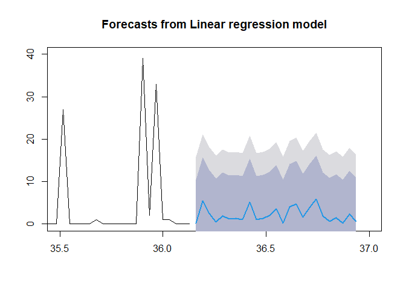<!-- -->


```r
# decompose time series into trend, seasonal, random, then plot
components070809SM2daily <- decompose(tsSM2_070809daily)
plot(components070809SM2daily)
```

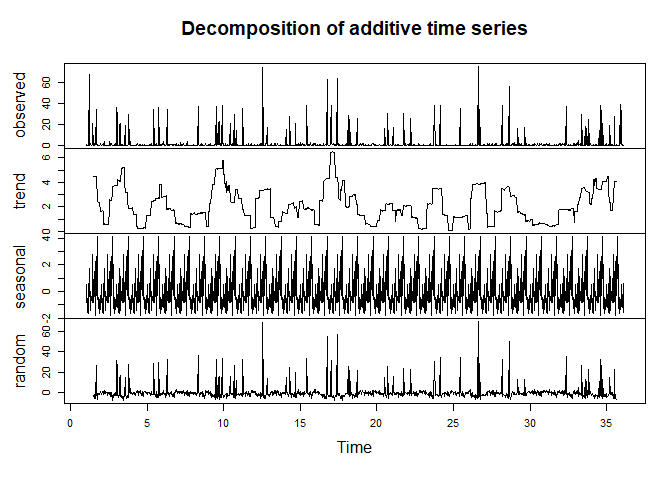<!-- -->

```r
summary(components070809SM2daily)  
```

```
##          Length Class  Mode     
## x        1090   ts     numeric  
## seasonal 1090   ts     numeric  
## trend    1090   ts     numeric  
## random   1090   ts     numeric  
## figure     31   -none- numeric  
## type        1   -none- character
```

#### Trend reveals power use decline with high of 2.4 2008 Q2 to low of 1.6 in 2009 Q2, then rises to 2.1 mid-2009

## Holt Winters Forecasting Submeter 2 - Exponential Smoothing

```r
# first subtract the seasonal component removed in prior step
tsSM2_070809Adjusted <- tsSM2_070809daily - components070809SM2daily$seasonal
autoplot(tsSM2_070809Adjusted)
```

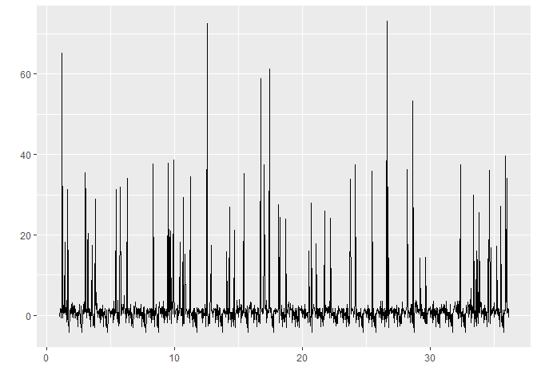<!-- -->

```r
# test seasonal adjustment by running decompose again, note extremely small scale in seasonal line
plot(decompose(tsSM2_070809Adjusted))
```

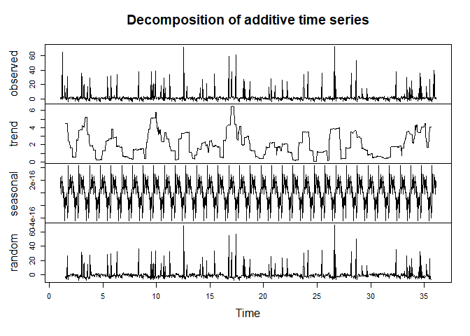<!-- -->

## Holt Winters Exponential Smoothing Submeter 2

```r
tsSM2_HW <- HoltWinters(tsSM2_070809daily)
tsSM2_HW
```

```
## Holt-Winters exponential smoothing with trend and additive seasonal component.
## 
## Call:
## HoltWinters(x = tsSM2_070809daily)
## 
## Smoothing parameters:
##  alpha: 0.02632652
##  beta : 0.02073226
##  gamma: 0.1238543
## 
## Coefficients:
##            [,1]
## a    3.33387824
## b    0.02832228
## s1  -0.17825008
## s2   4.96435454
## s3  -0.03602790
## s4  -0.12910798
## s5  -0.21732565
## s6  -0.38482181
## s7   2.48241698
## s8   1.98696538
## s9   0.52266854
## s10  0.42210545
## s11 -0.52639014
## s12  4.55817131
## s13 -0.37923183
## s14 -0.78170566
## s15  7.68326274
## s16  6.42314059
## s17 -0.47038452
## s18  2.88480891
## s19  4.07309754
## s20 -0.05191930
## s21 -0.83461963
## s22  1.81186268
## s23 -0.85687870
## s24  4.01163200
## s25 -0.23398287
## s26  3.68015424
## s27 -0.26335802
## s28 -0.98325037
## s29 -0.44610657
## s30 -0.71369421
## s31  0.82354609
```

```r
plot(tsSM2_HW, ylim = c(0, 20))
```

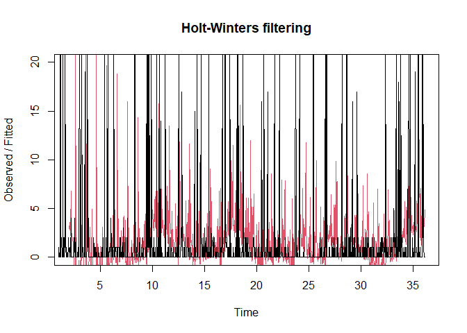<!-- -->


```r
# holt winters forecast
tsSM2_HWforecast <- forecast(tsSM2_HW, h=25)
tsSM2_HWforecast
```

```
##          Point Forecast      Lo 80    Hi 80      Lo 95    Hi 95
## 36.16129       3.183950 -7.3815184 13.74942 -12.974540 19.34244
## 36.19355       8.354877 -2.2144056 18.92416  -7.809446 24.51920
## 36.22581       3.382817 -7.1904349 13.95607 -12.787576 19.55321
## 36.25806       3.318059 -7.2593199 13.89544 -12.858646 19.49476
## 36.29032       3.258164 -7.3235034 13.83983 -12.925100 19.44143
## 36.32258       3.118990 -7.4671293 13.70511 -13.071082 19.30906
## 36.35484       6.014551 -4.5761872 16.60529 -10.182585 22.21169
## 36.38710       5.547422 -5.0481052 16.14295 -10.657038 21.75188
## 36.41935       4.111447 -6.4890411 14.71194 -12.100601 20.32350
## 36.45161       4.039206 -6.5664189 14.64483 -12.180698 20.25911
## 36.48387       3.119033 -7.4919076 13.72997 -13.109000 19.34707
## 36.51613       8.231917 -2.3845206 18.84835  -8.004523 24.46836
## 36.54839       3.322836 -7.2992823 13.94495 -12.922292 19.56796
## 36.58065       2.948684 -7.6793018 13.57667 -13.305418 19.20279
## 36.61290      11.441975  0.8079312 22.07602  -4.821392 27.70534
## 36.64516      10.210175 -0.4301190 20.85047  -6.062751 26.48310
## 36.67742       3.344972 -7.3017676 13.99171 -12.937811 19.62776
## 36.70968       6.728488 -3.9248958 17.38187  -9.564457 23.02143
## 36.74194       7.945099 -2.7151297 18.60533  -8.358314 24.24851
## 36.77419       3.848404 -6.8188728 14.51568 -12.465788 20.16260
## 36.80645       3.094026 -7.5805057 13.76856 -13.231262 19.41931
## 36.83871       5.768831 -4.9131650 16.45083 -10.567872 22.10553
## 36.87097       3.128412 -7.5612597 13.81808 -13.220030 19.47685
## 36.90323       8.025245 -2.6723168 18.72281  -8.335264 24.38575
## 36.93548       3.807952 -6.8977164 14.51362 -12.564955 20.18086
```


```r
plot(tsSM2_HWforecast, ylim = c(0, 20), xlim = c(34, 38), ylab = 'Watts', xlab = 'Time', main = 'Submeter 2 Laundry: Holt-Winters 25-Day Forecast')
```

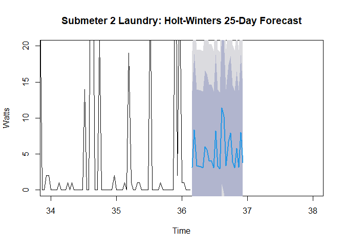<!-- -->

#### Observations
* Submeter 2 regression line for 25 day Holt-Winters forecast ranges from 3 to 13 daily Watts


## Comparison of all seasonal decomposition model results

```r
decomposition_summary_seasonal <- data.frame(rbind(summary(components070809SM1daily$seasonal), summary(components070809SM2daily$seasonal), summary(components070809SM3weekly$seasonal)))

decomposition_summary_seasonal['Timeseries'] <- data.frame(rbind('Daily Sub1 TS Seasonal', 'Daily Sub2 TS seasonal', 'Weekly Sub3 TS Seasonal'))

kable(decomposition_summary_seasonal, format = 'html', caption = 'Results of All Seasonal Decomposition Models', digits=3) %>% kable_styling(bootstrap_options = 'striped', full_width = FALSE)
```

<table class="table table-striped" style="width: auto !important; margin-left: auto; margin-right: auto;">
<caption>Results of All Seasonal Decomposition Models</caption>
 <thead>
  <tr>
   <th style="text-align:right;"> Min. </th>
   <th style="text-align:right;"> X1st.Qu. </th>
   <th style="text-align:right;"> Median </th>
   <th style="text-align:right;"> Mean </th>
   <th style="text-align:right;"> X3rd.Qu. </th>
   <th style="text-align:right;"> Max. </th>
   <th style="text-align:left;"> Timeseries </th>
  </tr>
 </thead>
<tbody>
  <tr>
   <td style="text-align:right;"> -1.137 </td>
   <td style="text-align:right;"> -1.055 </td>
   <td style="text-align:right;"> -0.948 </td>
   <td style="text-align:right;"> 0.004 </td>
   <td style="text-align:right;"> -0.882 </td>
   <td style="text-align:right;"> 33.467 </td>
   <td style="text-align:left;"> Daily Sub1 TS Seasonal </td>
  </tr>
  <tr>
   <td style="text-align:right;"> -1.810 </td>
   <td style="text-align:right;"> -1.059 </td>
   <td style="text-align:right;"> -0.487 </td>
   <td style="text-align:right;"> -0.002 </td>
   <td style="text-align:right;"> 0.601 </td>
   <td style="text-align:right;"> 4.095 </td>
   <td style="text-align:left;"> Daily Sub2 TS seasonal </td>
  </tr>
  <tr>
   <td style="text-align:right;"> -3.963 </td>
   <td style="text-align:right;"> -3.053 </td>
   <td style="text-align:right;"> -2.687 </td>
   <td style="text-align:right;"> 0.094 </td>
   <td style="text-align:right;"> 5.486 </td>
   <td style="text-align:right;"> 14.707 </td>
   <td style="text-align:left;"> Weekly Sub3 TS Seasonal </td>
  </tr>
</tbody>
</table>

#### Observation: Seasonal median and means are all negative

## Comparison of all trend decomposition model results

```r
decomposition_summary_trend <- data.frame(rbind(summary(components070809SM1daily$trend), summary(components070809SM2daily$trend),summary(components070809SM3weekly$trend)))

decomposition_summary_trend['Timeseries'] <- data.frame(rbind('Daily Sub1 TS Trend', 'Daily Sub2 TS Trend', 'Weekly Sub3 TS Trend'))

kable(decomposition_summary_trend, format = 'html', caption = 'Results of All Trend Decomposition Models', digits=3) %>% kable_styling(bootstrap_options = 'striped', full_width = FALSE)
```

<table class="table table-striped" style="width: auto !important; margin-left: auto; margin-right: auto;">
<caption>Results of All Trend Decomposition Models</caption>
 <thead>
  <tr>
   <th style="text-align:right;"> Min. </th>
   <th style="text-align:right;"> X1st.Qu. </th>
   <th style="text-align:right;"> Median </th>
   <th style="text-align:right;"> Mean </th>
   <th style="text-align:right;"> X3rd.Qu. </th>
   <th style="text-align:right;"> Max. </th>
   <th style="text-align:right;"> NA.s </th>
   <th style="text-align:left;"> Timeseries </th>
  </tr>
 </thead>
<tbody>
  <tr>
   <td style="text-align:right;"> 0.619 </td>
   <td style="text-align:right;"> 0.751 </td>
   <td style="text-align:right;"> 1.066 </td>
   <td style="text-align:right;"> 1.041 </td>
   <td style="text-align:right;"> 1.203 </td>
   <td style="text-align:right;"> 1.762 </td>
   <td style="text-align:right;"> 364 </td>
   <td style="text-align:left;"> Daily Sub1 TS Trend </td>
  </tr>
  <tr>
   <td style="text-align:right;"> 0.065 </td>
   <td style="text-align:right;"> 1.129 </td>
   <td style="text-align:right;"> 1.806 </td>
   <td style="text-align:right;"> 2.084 </td>
   <td style="text-align:right;"> 3.065 </td>
   <td style="text-align:right;"> 6.516 </td>
   <td style="text-align:right;"> 30 </td>
   <td style="text-align:left;"> Daily Sub2 TS Trend </td>
  </tr>
  <tr>
   <td style="text-align:right;"> 1.769 </td>
   <td style="text-align:right;"> 2.356 </td>
   <td style="text-align:right;"> 3.019 </td>
   <td style="text-align:right;"> 3.254 </td>
   <td style="text-align:right;"> 3.760 </td>
   <td style="text-align:right;"> 6.500 </td>
   <td style="text-align:right;"> 52 </td>
   <td style="text-align:left;"> Weekly Sub3 TS Trend </td>
  </tr>
</tbody>
</table>

#### Observation: Daily and weekly trends all positive


## Comparison of all random decomposition model results

```r
decomposition_summary_random <- data.frame(rbind(summary(components070809SM1daily$random), summary(components070809SM2daily$random),summary(components070809SM3weekly$random)))

decomposition_summary_random['Timeseries'] <- data.frame(rbind('Daily Sub1 TS Random', 'Daily Sub2 TS Random', 'Weekly Sub3 TS Random'))

kable(decomposition_summary_random, format = 'html', caption = 'Results of All Random Decomposition Models', digits=3) %>% kable_styling(bootstrap_options = 'striped', full_width = FALSE)
```

<table class="table table-striped" style="width: auto !important; margin-left: auto; margin-right: auto;">
<caption>Results of All Random Decomposition Models</caption>
 <thead>
  <tr>
   <th style="text-align:right;"> Min. </th>
   <th style="text-align:right;"> X1st.Qu. </th>
   <th style="text-align:right;"> Median </th>
   <th style="text-align:right;"> Mean </th>
   <th style="text-align:right;"> X3rd.Qu. </th>
   <th style="text-align:right;"> Max. </th>
   <th style="text-align:right;"> NA.s </th>
   <th style="text-align:left;"> Timeseries </th>
  </tr>
 </thead>
<tbody>
  <tr>
   <td style="text-align:right;"> -35.024 </td>
   <td style="text-align:right;"> -0.295 </td>
   <td style="text-align:right;"> -0.055 </td>
   <td style="text-align:right;"> -0.055 </td>
   <td style="text-align:right;"> 0.185 </td>
   <td style="text-align:right;"> 34.913 </td>
   <td style="text-align:right;"> 364 </td>
   <td style="text-align:left;"> Daily Sub1 TS Random </td>
  </tr>
  <tr>
   <td style="text-align:right;"> -8.198 </td>
   <td style="text-align:right;"> -2.858 </td>
   <td style="text-align:right;"> -1.150 </td>
   <td style="text-align:right;"> -0.022 </td>
   <td style="text-align:right;"> 0.235 </td>
   <td style="text-align:right;"> 69.228 </td>
   <td style="text-align:right;"> 30 </td>
   <td style="text-align:left;"> Daily Sub2 TS Random </td>
  </tr>
  <tr>
   <td style="text-align:right;"> -10.548 </td>
   <td style="text-align:right;"> -1.716 </td>
   <td style="text-align:right;"> -0.120 </td>
   <td style="text-align:right;"> -0.226 </td>
   <td style="text-align:right;"> 1.264 </td>
   <td style="text-align:right;"> 10.096 </td>
   <td style="text-align:right;"> 52 </td>
   <td style="text-align:left;"> Weekly Sub3 TS Random </td>
  </tr>
</tbody>
</table>

## Comparison of all Linear Regression mean forecasted results

```r
lm_summary <- data.frame(rbind(summary(forecastfitSM1$mean), summary(forecastfitSM2$mean), summary(forecastfitSM3$mean)))

lm_summary['Timeseries'] <- data.frame(rbind('Sub1 Linear Time Series 25-Day Forecast', 'Sub2 Linear Time Series 25-Day Forecast', 'Sub3 Linear Time Series 10-Week Forecast'))

kable(lm_summary, format = 'html', caption = 'Results of All Linear Regression Forecasted Models', digits=3) %>% kable_styling(bootstrap_options = 'striped', full_width = FALSE)
```

<table class="table table-striped" style="width: auto !important; margin-left: auto; margin-right: auto;">
<caption>Results of All Linear Regression Forecasted Models</caption>
 <thead>
  <tr>
   <th style="text-align:right;"> Min. </th>
   <th style="text-align:right;"> X1st.Qu. </th>
   <th style="text-align:right;"> Median </th>
   <th style="text-align:right;"> Mean </th>
   <th style="text-align:right;"> X3rd.Qu. </th>
   <th style="text-align:right;"> Max. </th>
   <th style="text-align:left;"> Timeseries </th>
  </tr>
 </thead>
<tbody>
  <tr>
   <td style="text-align:right;"> 0.467 </td>
   <td style="text-align:right;"> 0.623 </td>
   <td style="text-align:right;"> 0.623 </td>
   <td style="text-align:right;"> 1.138 </td>
   <td style="text-align:right;"> 0.623 </td>
   <td style="text-align:right;"> 13.623 </td>
   <td style="text-align:left;"> Sub1 Linear Time Series 25-Day Forecast </td>
  </tr>
  <tr>
   <td style="text-align:right;"> 0.226 </td>
   <td style="text-align:right;"> 1.054 </td>
   <td style="text-align:right;"> 1.683 </td>
   <td style="text-align:right;"> 2.188 </td>
   <td style="text-align:right;"> 3.569 </td>
   <td style="text-align:right;"> 5.854 </td>
   <td style="text-align:left;"> Sub2 Linear Time Series 25-Day Forecast </td>
  </tr>
  <tr>
   <td style="text-align:right;"> -2.374 </td>
   <td style="text-align:right;"> -0.957 </td>
   <td style="text-align:right;"> 3.293 </td>
   <td style="text-align:right;"> 2.193 </td>
   <td style="text-align:right;"> 3.293 </td>
   <td style="text-align:right;"> 8.960 </td>
   <td style="text-align:left;"> Sub3 Linear Time Series 10-Week Forecast </td>
  </tr>
</tbody>
</table>

## Comparison of all Holt Winters mean forecasted results

```r
hw_summary <- data.frame(rbind(summary(tsSM1_HWforecast$mean), summary(tsSM2_HWforecast$mean), summary(tsSM3_HWforecast$mean)))

hw_summary['Timeseries'] <- data.frame(rbind('Sub1 Holt Winters 25-Day Forecast', 'Sub2 Holt Winters 25-Day Forecast', 'Sub3 Holt Winters 10-Week Forecast'))

kable(hw_summary, format = 'html', caption = 'Results of All Holt Winters Forecasted Models', digits=3) %>% kable_styling(bootstrap_options = 'striped', full_width = FALSE)
```

<table class="table table-striped" style="width: auto !important; margin-left: auto; margin-right: auto;">
<caption>Results of All Holt Winters Forecasted Models</caption>
 <thead>
  <tr>
   <th style="text-align:right;"> Min. </th>
   <th style="text-align:right;"> X1st.Qu. </th>
   <th style="text-align:right;"> Median </th>
   <th style="text-align:right;"> Mean </th>
   <th style="text-align:right;"> X3rd.Qu. </th>
   <th style="text-align:right;"> Max. </th>
   <th style="text-align:left;"> Timeseries </th>
  </tr>
 </thead>
<tbody>
  <tr>
   <td style="text-align:right;"> 0.417 </td>
   <td style="text-align:right;"> 0.436 </td>
   <td style="text-align:right;"> 0.984 </td>
   <td style="text-align:right;"> 2.107 </td>
   <td style="text-align:right;"> 1.043 </td>
   <td style="text-align:right;"> 33.765 </td>
   <td style="text-align:left;"> Sub1 Holt Winters 25-Day Forecast </td>
  </tr>
  <tr>
   <td style="text-align:right;"> 2.949 </td>
   <td style="text-align:right;"> 3.258 </td>
   <td style="text-align:right;"> 3.848 </td>
   <td style="text-align:right;"> 5.172 </td>
   <td style="text-align:right;"> 6.728 </td>
   <td style="text-align:right;"> 11.442 </td>
   <td style="text-align:left;"> Sub2 Holt Winters 25-Day Forecast </td>
  </tr>
  <tr>
   <td style="text-align:right;"> 5.777 </td>
   <td style="text-align:right;"> 5.963 </td>
   <td style="text-align:right;"> 6.188 </td>
   <td style="text-align:right;"> 7.866 </td>
   <td style="text-align:right;"> 6.377 </td>
   <td style="text-align:right;"> 19.477 </td>
   <td style="text-align:left;"> Sub3 Holt Winters 10-Week Forecast </td>
  </tr>
</tbody>
</table>


#### Observations
* Holt Winters forecasted results will be used for energy use predictions
  + Submeter 1 (Kitchen): mean of 2.107 Watt/hour energy use forecasted for 25 days
  + Submeter 2 (Laundry): mean of 5.172 Watts/hour energy use forecasted for 25 days
  + Submeter 3 (Water heater & AC): mean of 7.866 Watts/hour for 10 week forecast
  + Predicted average energy use in watts/hour for each submeter is projected to be higher than average energy used from 2007-2010 (Sub1 1.16 Watts/hour, Sub2 1.34 Watts/hour, Sub3 6.21 Watts/hour). Energy saving recommendations going in to 2010 are provided to help reduce energy and save money.

#### Energy Saving Recommendations
* Reset HVAC controls to reduce daily Water Heater & AC spikes noted throughout the year to save energy
* Reduce the length of time AC and/or Water Heater is programmed to turn on during the day
* Reset AC thermometer in winter months to higher temperature setting to reduce energy use during peak season
* Regularly replace AC filters, turn off lights whenever you leave a room, and reduce amount of hot water used when possible

